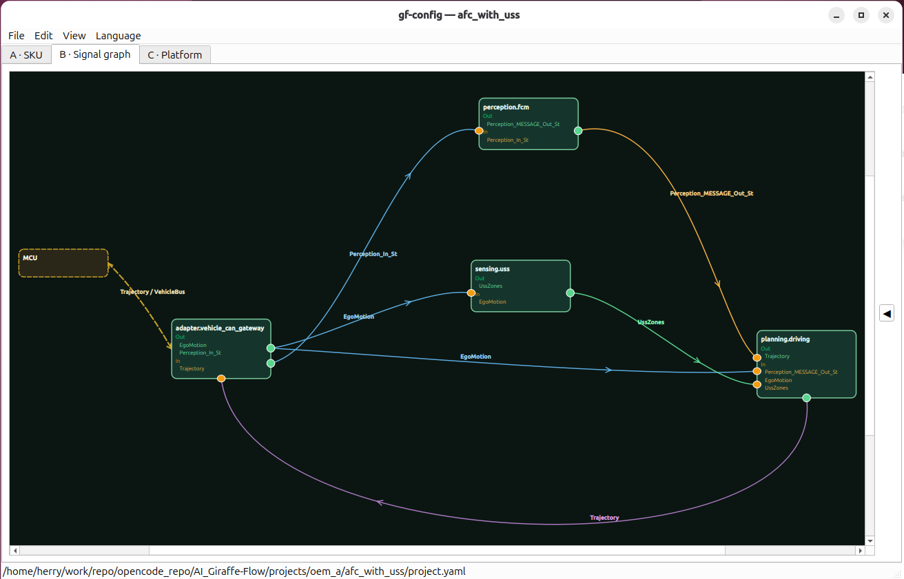
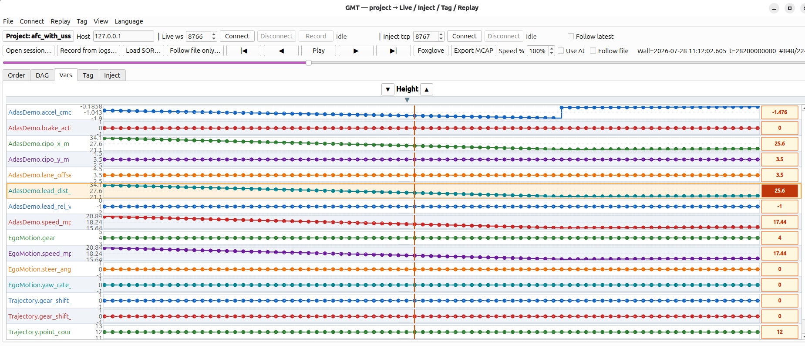

# AI Giraffe Flow

**Lightweight middleware + toolchain for cross-platform SOA systems.**

Desktop-first, **ARM Linux** embedded primary (OSAL reserved for MIPS / RISC-V). The middleware is a trimmable `gf_ara::*` runtime with pluggable transports; the toolchain wraps it—**gf-config** turns vehicle contracts into SOR and codegen, **GMT** turns multi-process bring-up from log-chasing into scrub / inject / Foxglove. The product core remains the **Giraffe modules** that actually run on SIL and on the board.

**中文:** [README_zh.md](README_zh.md)

---

## Overview

| # | Pillar | Role | Dig in |
|---|--------|------|--------|
| **1** | **gf-config** | Toolchain · configure | [tools/config](tools/config/README.md) · [SOR](docs/en/architecture/sor-authoring.md) |
| **2** | **Giraffe modules** | **Product core** · runtime & processes | [middleware](middleware/README.md) · [Design](docs/en/architecture/DESIGN.md) · [Sample](projects/oem_a/afc_with_uss/) |
| **3** | **GMT** | Toolchain · observe / inject | [tools/gmt](tools/gmt/README.md) · [Observability demo](docs/zh/operations/OBSERVABILITY_DEMO.md) |

```text
┌─ Host tool · configure ──────────────────────────────┐
│  gf-config · req.yaml / wiring.yaml                  │
│       │ compose / lint / generate                    │
│       ▼                                              │
│  gf.sor.json  +  Proxy / Skeleton / deploy lists     │
└───────────────────────┬──────────────────────────────┘
                        │ flash / build into target
                        ▼

         ╔══ ARM · MIPS · RISC-V · … ══╗
   ║║║  ┌────────────╨─────────────────────┐  ║║║
   ║║║  │   ▓▓▓  SIL / HIL · BOARD  ▓▓▓    │  ║║║
   ║║║  │                                  │  ║║║
   ║║║  │  Giraffe modules · product core  │  ║║║
   ║║║  │                                  │  ║║║
   ║║║  │  ┌─ SoC · middleware / gf_ara ─┐ │  ║║║
   ║║║  │  │ com → iceoryx|SOME/IP|DDS   │ │  ║║║
   ║║║  │  │ exec / phm / sm · OSAL/log  │ │  ║║║
   ║║║  │  └─────────────────────────────┘ │  ║║║
   ║║║  │             │ semantic services  │  ║║║
   ║║║  │  ┌─ apps (on-board processes) ─┐ │  ║║║
   ║║║  │  │ gateway · sensing · FCM     │ │  ║║║
   ║║║  │  │ planning · tap / inject     │ │  ║║║
   ║║║  │  └─────────────────────────────┘ │  ║║║
   ║║║  │  projects/<oem>/<sku> + SIL      │  ║║║
   ║║║  └───┬──────────────────────────┬───┘  ║║║
            │                          │
            ▼ tap / observe            ▲ inject / drive
            │                          │
╔═══════════╧══════════════════════════╧═══════════════╗
║   Host tool · GMT          observe / inject          ║
║══════════════════════════════════════════════════════║
║   · Live ws (8766)     · Order / race                ║
║   · Animated DAG       · Vars strip                  ║
║   · Tag / clip         · MCAP · VCD export           ║
║   · Foxglove (8765)    · playhead inject (8767)      ║
╚══════════════════════════════════════════════════════╝
```

---

### 1. gf-config (configure toolchain)

Defines **what** and **who talks to whom** — not algorithms.

- Tab A → `req.yaml` (SKU / trim / live_tap)
- Tab B → `wiring.yaml` (signal graph)
- Verify / Generate → SOR + codegen



```bash
gf-config projects/oem_a/afc_with_uss/project.yaml
```

Details: [tools/config/README.md](tools/config/README.md) · [WORKFLOW](docs/en/operations/WORKFLOW.md)

---

### 2. Giraffe modules (core)

What actually runs on the board and in SIL. Production algorithms may live in **external repos**; this tree ships a **trimmable platform + reference processes** on one semantic contract.

#### 2.1 Layers

| Layer | Path | Role |
|-------|------|------|
| **API / runtime** | `middleware/` | Public `gf_ara::*`; trim via SKU `runtime_modules` |
| **Transports** | `middleware/bindings/` | iceoryx, SOME/IP, DDS, cross_domain_ipc (MCU) |
| **Exec / health** | exec / phm / sm | Launch, heartbeat, state groups |
| **Portability** | `osal/` · `hal/` | Clock/thread; ARM Linux first |
| **Reference apps** | `apps/` | Gateway, sensing/perception/planning stubs, obs tools — **not production algos** |
| **Integration** | `projects/` | OEM DBC / wiring / hpp / SIL·HIL scripts |

Rule: **apps depend only on semantic service names**; OEM deltas stay in adapter/gateway. See [DESIGN](docs/en/architecture/DESIGN.md).

#### 2.2 Middleware packages (SKU-trim)

| Package | Role |
|---------|------|
| [com](middleware/com/) | Unified com (Proxy / Skeleton) |
| [bindings/iceoryx](middleware/bindings/iceoryx/) … | Transport backends |
| [exec](middleware/exec/) / [phm](middleware/phm/) / [sm](middleware/sm/) | Execution / health / state |
| [osal](middleware/osal/) | OS abstraction |
| [ucm](middleware/ucm/) / [diag](middleware/diag/) | OTA / DoIP skeletons |
| [log](middleware/log/) / [trace](middleware/trace/) | Logging & timing |

Overview: [middleware/README.md](middleware/README.md)

#### 2.3 Reference chain (sample SKU)

[oem_a / afc_with_uss](projects/oem_a/afc_with_uss/):

```text
Vehicle state (pick one)
  · gateway (no inject)   or   · inject (playhead; gateway off)
        │
        ▼ EgoMotion
   ┌────┴────┬────────────┐
   ▼         ▼            ▼
  USS      FCM stub     (Ego subscribers)
   │         │
   ▼         ▼
 UssZones   Perception_Out
        \   /
         ▼
      planning → Trajectory
        │
        ▼
   tap → Foxglove / GMT Live
```

| Process | Role |
|---------|------|
| `adapter.vehicle_can_gateway` | CAN/sim → EgoMotion, Perception_In… (off under inject) |
| `sensing.uss` | Ego → UssZones |
| `perception.fcm` | Perception_In or (inject) Ego → perception stub |
| `planning.driving` | Ego (+ optional perc/USS) → Trajectory |
| `gf_iox_obs_tap` | Allowlisted services → NDJSON |
| `gf_iox_obs_inject` | playhead / continuous Ego inject |

Production perception/planning: **external packages**. See [apps/](apps/README.md).

#### 2.4 Product path (SIL)

```bash
bash projects/oem_a/afc_with_uss/scripts/compile_sil.sh
bash projects/oem_a/afc_with_uss/scripts/run_sil.sh

GF_INJECT_MODE=playhead GF_INJECT_LIVE=all \
  bash projects/oem_a/afc_with_uss/scripts/run_sil.sh
```

Scripts: [scripts/README.md](projects/oem_a/afc_with_uss/scripts/README.md)  
Scenarios: [scenarios/README.md](projects/oem_a/afc_with_uss/scenarios/README.md)

#### 2.5 Boundary vs toolchain

| Giraffe modules own | Toolchain owns |
|---------------------|----------------|
| In-process I/O, real pub/sub on iceoryx | wiring / SKU trim → gf-config |
| SIL: RouDi + apps + tap/inject | Studio layout, Tag, MCAP → GMT / Foxglove |
| Semantic contract on target | DBC / lineage gates → compose |

---

### 3. GMT (observe toolchain)

In multi-process SIL, terminal logs rarely answer “who published what, when.” GMT attaches the same tap stream to a host timeline and Foxglove: **scrub / speed** align DAG and variables, **playhead inject** drives Ego into the chain frame-by-frame (gateway off, no dual publish), then **Tag → MCAP** when you need a clip. Few ports, one `run_sil` companion—cheap to “change and look again.” It **does not replace modules**; it makes them repeatedly verifiable.



| Port | Role |
|------|------|
| **8765** | Foxglove (module I/O → optional BEV) |
| **8766** | GMT Live (optional) |
| **8767** | playhead inject |

```bash
pip install -e tools/gmt -e 'tools/gmt[gui]'
GMT gui --project projects/oem_a/afc_with_uss \
  --session projects/oem_a/afc_with_uss/scenarios/overtake_acc_aeb.jsonl
```

Details: [tools/gmt/README.md](tools/gmt/README.md) · [OBSERVABILITY_DEMO](docs/zh/operations/OBSERVABILITY_DEMO.md)

---

## Repo map

| Path | Role |
|------|------|
| [middleware/](middleware/) | **Giraffe runtime (core)** |
| [apps/](apps/) | Reference apps / adapters / tap·inject |
| [projects/](projects/) | OEM integration |
| [tools/config/](tools/config/) | gf-config |
| [tools/codegen/](tools/codegen/) | gf-codegen |
| [tools/gmt/](tools/gmt/) | GMT |
| [docs/](docs/README.md) | Docs index |

[STRUCTURE.md](STRUCTURE.md) · [ROADMAP](docs/en/operations/ROADMAP.md)

## License

[LICENSE](LICENSE)
