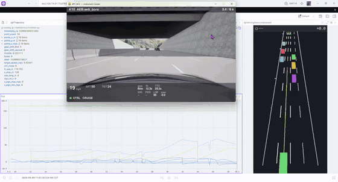
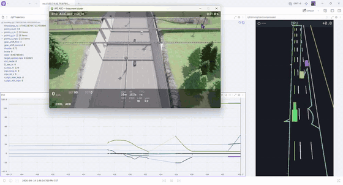
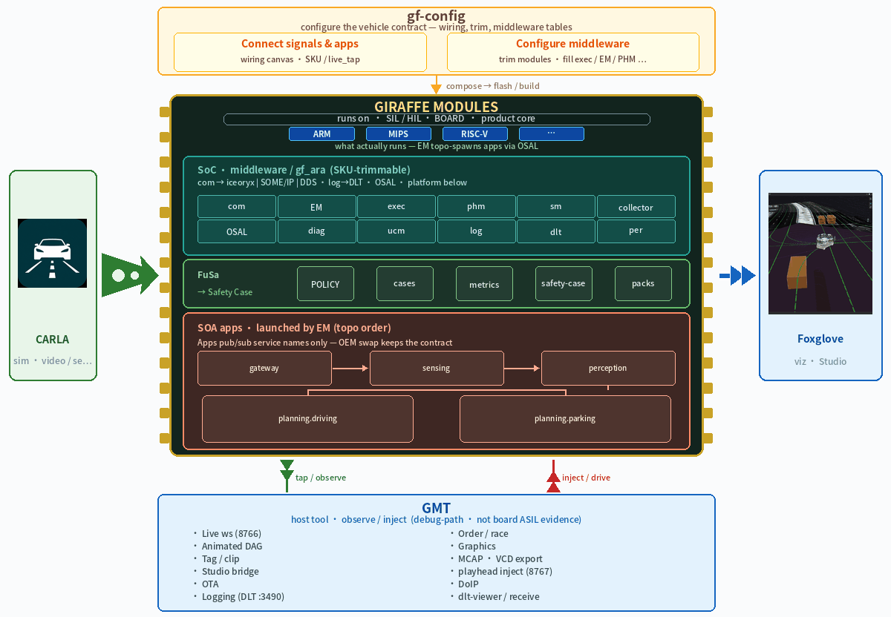
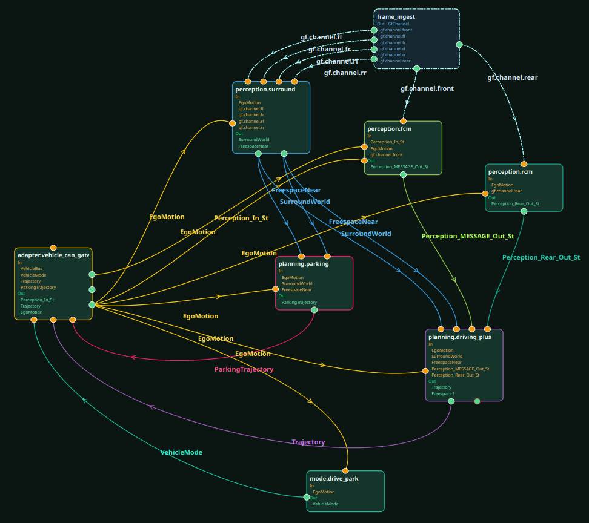
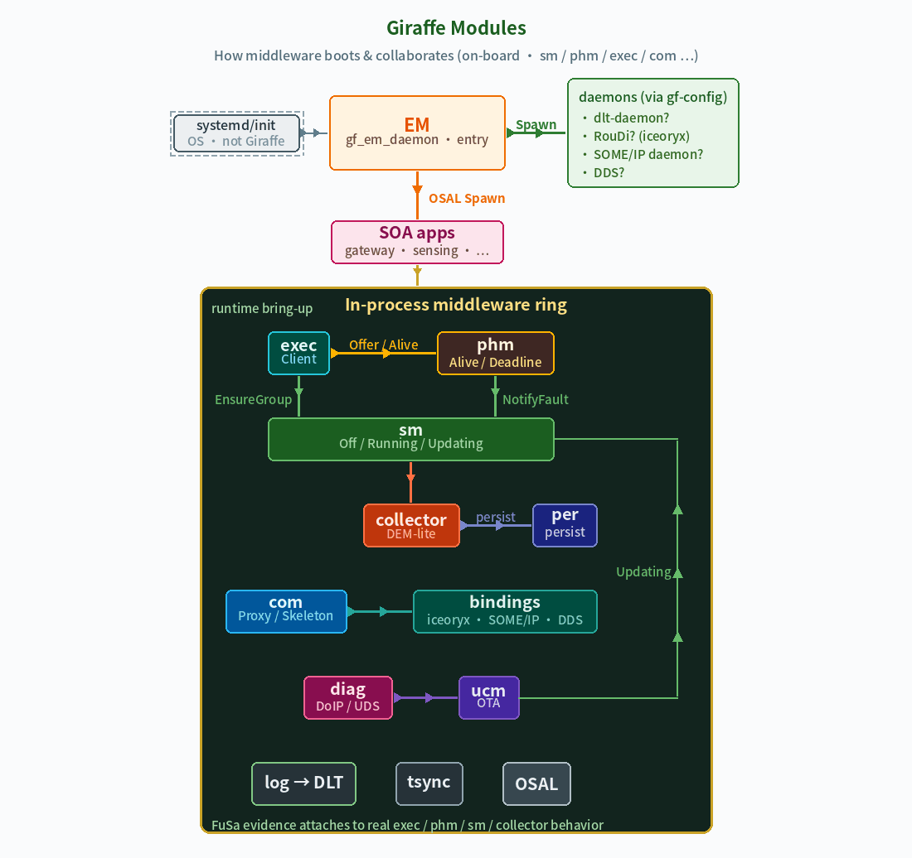
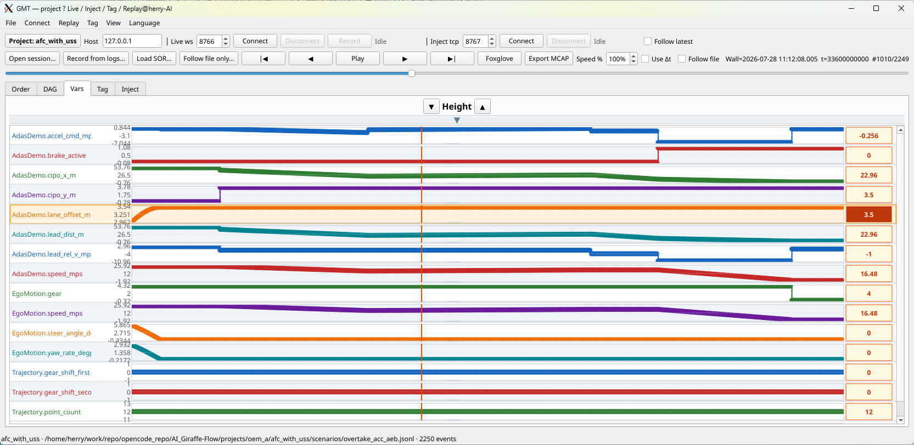

# AI Giraffe Flow

**Lightweight SOA middleware + toolchain.**

Why this repo: so a trimmable on-board SOA is authored, run, seen, and stressed on the bench — then the **same EM** goes to the board. When it is done you can decompose an OEM contract into a running runtime without hand-written plumbing, kill a process and keep control, measure a real tick, put the same chain back, and **CD only what passed**. Hardware is the last mile.

The product is a trimmable `gf_ara::*` runtime (**ARM Linux** first; OSAL reserved for MIPS / RISC-V) and three tools around it: **gf-config** authors what runs and who talks to whom; **Giraffe modules** are the on-target SOA (EM launch, com, PHM, isolation); **GMT** answers *who published what, when* and injects the same chain. In-tree perception and planning are a **closed-loop workload**, not an ADAS product — they exist to prove the traits above. OEM cameras and NN weights stay out of tree.

| Feature | Why it matters |
|---------|----------------|
| **Robustness / isolation** | A fault stays in one process; the rest **hold-last**. One EM owns the topology: spawn, PHM, relaunch **that** process — not the whole stack. Same entry on SIL and on the board. |
| **Latency** | High throughput, low latency — **overlay-latest**, no blocking IPC. |
| **Visibility** | The live chain stays in the open — measure it, watch it, play it back, same picture. |
| **Inject / replay** | Same wiring, same types; put the scene back on that chain. |
| **CI/CD with FuSa** | Compose → generate → SIL, FuSa in the CI loop. **CD only what passed.** |
| **OEM decomposition** | Tools split the OEM contract into modules. No hand wiring; every change is traceable. |

The clips below are that loop on the bench — **AFC** (single camera) and **ADC** (surround). The car is the hook; the claim is the stack behind it.

**中文:** [README_zh.md](README_zh.md)

<p align="center">
  Single camera (AFC) <a href="gallery/videos/afc.mp4">mp4</a>
</p>

<p align="center">
  
</p>

<p align="center">
  Multi cameras (ADC) <a href="gallery/videos/adc.mp4">mp4</a>
</p>

<p align="center">
  
</p>

---

## Overview

| # | Pillar | Role | Dig in |
|---|--------|------|--------|
| **1** | **gf-config** | Toolchain · configure | [tools/gf-config](tools/gf-config/README.md) · [SOR](docs/en/architecture/sor-authoring.md) |
| **2** | **Giraffe modules** | **Product core** · SOA runtime, FuSa evidence | [middleware](middleware/README.md) · [fusa/](fusa/README.md) · [Design](docs/en/architecture/DESIGN.md) |
| **3** | **GMT** | Toolchain · observe / inject / Foxglove | [tools/gmt](tools/gmt/README.md) · [gmt_board](tools/gmt_board/README.md) · [Observability demo](docs/zh/operations/OBSERVABILITY_DEMO.md) |



---

### 1. gf-config (configure toolchain)

Defines **what**, **who talks to whom**, and **which board modules to trim** — not algorithms. Two tabs write three asset layers:

| Tab | Writes | Output |
|-----|--------|--------|
| **1 · Signals & apps** | Thin SKU (`req.yaml`) + wiring canvas (`wiring.yaml`) | deployments / dataflows / live_tap |
| **2 · Platform runtime** | `runtime_modules` + `cfg/gf_ara_cfg/*` (exec · **EM launch** · PHM · collector · diag · log · ucm; **per/tsync** trimable) | `gf_ara_cfg_manifest` → CMake trim / EM topo |

- Verify / Generate → SOR + Proxy/Skeleton + lineage (incl. `platform_em_launch`)



```bash
gf-config projects/afc/giraffe.yaml
```

Details: [tools/gf-config/README.md](tools/gf-config/README.md) · [WORKFLOW](docs/en/operations/WORKFLOW.md)

---

### 2. Giraffe modules (core)

What actually runs on the board and in SIL is the **middleware**. SKU apps (FCM, Octave planning → Trajectory) are the **exercise load**: a real pub/sub loop so GMT, Foxglove, inject, PHM, and CI have something honest to measure — not a claim that this repo is a production ADAS stack.



#### 2.1 Layers

| Layer | Path | Role |
|-------|------|------|
| **API / runtime** | `middleware/` | Public `gf_ara::*`; trim via SKU `runtime_modules` |
| **Transports** | `middleware/bindings/` | iceoryx, SOME/IP, DDS, cross_domain_ipc (MCU) |
| **Exec / health** | exec (**EM daemon**) / phm / sm / collector | Topo launch, relaunch, heartbeat, FG, events |
| **Portability** | `osal/` · `hal/` | Clock / thread / **process Spawn**; ARM Linux first |
| **Workload apps** | `projects/<sku>/apps/` | Gateway / FCM / planning — **load** to exercise the platform (`.m` gold → C 1:1) |
| **Host scenes** | `carla_scenarios/` | CARLA Client A: layout + instrument; another stress source, not the controller |
| **Integration** | `projects/` | OEM DBC / wiring / hpp / SIL·HIL / **CI scripts** |
| **FuSa evidence** | `fusa/` | Cases / metrics / Safety Case drafts (**not** a certificate) |

Rule: **apps depend only on semantic service names**; OEM deltas stay in adapter/gateway. See [DESIGN](docs/en/architecture/DESIGN.md).

#### 2.2 Middleware packages (SKU-trim)

Aligned with Giraffe SoC chips in the architecture GIF (`com` · `EM`∈exec · `exec` · `phm` · `sm` · `collector` · `OSAL` · `diag` · `ucm` · `log` · `per` · `tsync`).

| Package | Role |
|---------|------|
| [com](middleware/com/) | Unified com (Proxy / Skeleton) |
| [bindings/iceoryx](middleware/bindings/iceoryx/) … | Transport backends |
| [exec](middleware/exec/) | ExecutionClient + **EmDaemon** (OSAL Spawn；GIF 中 `EM`) |
| [phm](middleware/phm/) / [sm](middleware/sm/) / [collector](middleware/collector/) | Health / FG / event collect |
| [osal](middleware/osal/) | OS abstraction (incl. process；GIF 中 `OSAL`) |
| [diag](middleware/diag/) / [ucm](middleware/ucm/) | DoIP session / OTA orchestrator (SIL) |
| [log](middleware/log/) | Logging lite |
| [per](middleware/per/) / [tsync](middleware/tsync/) | Persistency KV stub / time-sync skeleton（可裁剪） |
| [trace](middleware/trace/) | Timing → VCD / GMT（偏 debug-path） |

Overview: [middleware/README.md](middleware/README.md)

#### 2.3 Closed-loop workload (sample SKUs)

Two SKUs **validate** com / EM / observability — they are not a perception or planner product. Planning gold: [octave_planning/](octave_planning/README.md).

| SKU | Cameras | Workload chain |
|-----|---------|----------------|
| [AFC](projects/afc/) | Single front | gateway → `perception.fcm` → `planning.driving` |
| [ADC](projects/adc/) | Surround | gateway → surround / fcm / rcm → `planning.driving_plus` · parking · `mode.drive_park` |

```text
Vehicle state (pick one)
  · gateway (no inject)   or   · inject (playhead; gateway off)
        │
        ▼ EgoMotion / Perception_In  (+ surround / rear on ADC)
        ▼
   perception.* → Out / Near / World     ← workload (not a camera NN)
        │
        ▼
   planning.* → Trajectory               ← workload (.m gold, C 1:1)
        │
        ▼
   gmt_board: tap NDJSON · gf_foxglove_ws :8765
        │
        └─ latency / isolation / “who published when” / inject replay
```

| Process | Role |
|---------|------|
| `adapter.vehicle_can_gateway` | CAN/sim → EgoMotion, Perception_In… (off under inject) |
| `perception.fcm` · `surround` · `rcm` | Workload perception (ADC adds surround + rear) |
| `planning.driving` / `driving_plus` | Ego + perc → Trajectory (workload) |
| `gf_iox_obs_tap` | Allowlisted services → NDJSON (GMT record) |
| `gf_foxglove_ws` | iceoryx → Foxglove Studio + BEV (`tools/gmt_board`) |
| `gf_iox_obs_inject` | playhead / continuous Ego inject |

SKU apps live under `projects/<sku>/apps/`. iceoryx smoke: `middleware/bindings/iceoryx/testcases/`.

#### 2.4 Build & run

Same scripts for [AFC](projects/afc/) and [ADC](projects/adc/). SIL overrides the frame source; the board freeze default stays `isp`. Host CARLA: [carla_scenarios/](carla_scenarios/). CI: [devops/](devops/README.md).

`GF_FRAME_SOURCE` = `carla` · `replay` · `colorbar` · `isp` · `none`

```bash
bash projects/adc/scripts/compile_sil.sh
GF_FRAME_SOURCE=carla bash projects/adc/scripts/run_sil.sh

# Same EM on the board (after stage):
#   ./projects/adc/build-sil/runtime/bin/giraffe_launch
```

AFC is the same path under `projects/afc/scripts/`. Inject / replay lives in GMT, not here.

#### 2.5 Boundary vs toolchain

| Giraffe modules own | Toolchain owns |
|---------------------|----------------|
| In-process I/O, real pub/sub on iceoryx | wiring / SKU trim → gf-config |
| SIL: systemd/init → EM → daemons + apps; tap/inject/Foxglove/DoIP = **GMT_depend** (not EM) | Studio / Tag / MCAP; Logging via DLT |
| Semantic contract on target | DBC / lineage gates → compose |
| FuSa evidence (`fusa/`) | GMT remains **debug-path** (not board ASIL evidence) |

#### 2.6 FuSa (inside Giraffe modules)

Evidence toward a **full Safety Case** — L1/L2/L3 cases, isolation, reference latency, Safety Case skeletons. Entry: [fusa/](fusa/README.md).

```bash
bash fusa/scripts/run_cases.sh
GF_FUSA_SIL=1 bash fusa/scripts/run_cases.sh
bash fusa/scripts/measure_latency.sh   # optional timing snapshot
```

---

### 3. GMT (observe toolchain)

In multi-process SIL, terminal logs rarely answer “who published what, when.” GMT attaches the tap NDJSON to a host timeline: **scrub / speed**, **playhead inject**, **Tag → MCAP**. **Foxglove live** is C `gf_foxglove_ws` on **:8765** (`tools/gmt_board`); Python `GMT bridge foxglove` is JSONL replay only. `run_sil` does **not** start GMT Live :8766.



| Port | Role |
|------|------|
| **8765** | Foxglove Studio (`gf_foxglove_ws`; BEV + module I/O) |
| **8766** | GMT GUI live (optional; not started by `run_sil`) |
| **8767** | playhead inject |

```bash
pip install -e tools/gmt -e 'tools/gmt[gui]'
GMT gui --project projects/afc \
  --session projects/afc/scenarios/overtake_acc_aeb.jsonl
```

Details: [tools/gmt/README.md](tools/gmt/README.md) · [gmt_board](tools/gmt_board/README.md) · [OBSERVABILITY_DEMO](docs/zh/operations/OBSERVABILITY_DEMO.md)

---

## Repo map

| Path | Role |
|------|------|
| [middleware/](middleware/) | **Giraffe runtime (core)** |
| [octave_planning/](octave_planning/) | Planning `.m` gold (**workload**, not the product) |
| [projects/](projects/) | OEM SKU: apps, wiring, SIL·HIL, CI scripts |
| [carla_scenarios/](carla_scenarios/) | Host CARLA scenes + instrument |
| [projects/afc/apps/](projects/afc/apps/) | AFC workload (gateway / FCM / planning) |
| [projects/adc/apps/](projects/adc/apps/) | ADC workload (surround / driving_plus / parking) |
| [fusa/](fusa/) | FuSa evidence |
| [tools/gf-config/](tools/gf-config/) | gf-config |
| [tools/gf-codegen/](tools/gf-codegen/) | gf-codegen |
| [tools/gf-octavecoder/](tools/gf-octavecoder/) | `.m` → C 1:1 |
| [tools/gmt/](tools/gmt/) | GMT host |
| [tools/gmt_board/](tools/gmt_board/) | tap / inject / `gf_foxglove_ws` |
| [devops/](devops/) | Bench CI → CD last mile (hardware) |
| [docs/](docs/README.md) | Docs index |

[STRUCTURE.md](STRUCTURE.md) · [ROADMAP](docs/en/operations/ROADMAP.md)

## License

[LICENSE](LICENSE)
