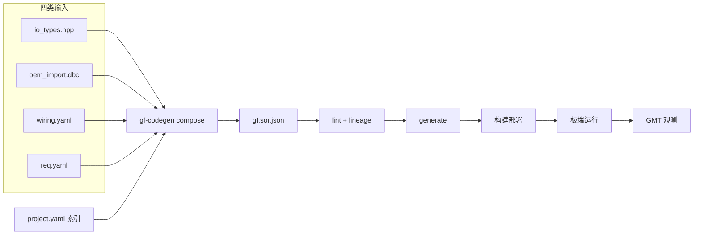

# AI Giraffe Flow（中文）

**轻量跨平台 SOA 中间件 + 工具链**：台式机先跑通，**嵌入式 ARM Linux** 优先；预留 MIPS / RISC-V。

**English:** [README.md](README.md)

> 状态：**集成输入 + `gf-codegen` MVP 已可用**（compose/lint/suggest/类型 generate）。运行时 iceoryx 双进程尚未开始 — 见 [P0_PLAN](docs/zh/operations/P0_PLAN.md)。

[STRUCTURE.md](STRUCTURE.md) · [路线图](docs/zh/operations/ROADMAP.md) · [P0 实施计划](docs/zh/operations/P0_PLAN.md) · [上传清单](projects/UPLOAD_CHECKLIST.md)

---

## 为什么做

感知 / 规划 / 控制团队需要进程管理、SOA、OEM 导入、ROS 零拷贝与可观测性，但不必买下完整 AP 商业栈。

**Giraffe Flow**：可裁剪工程平台 + **SOR → gf-codegen → GMT** 闭环，用分工与自动化把「开会扫表」换成「改 YAML + 一条命令」。

---

## 这个仓库是什么

| 部分 | 作用 |
|------|------|
| **运行时** | `gf_ara::com`、exec/phm/sm、**ucm（OTA）**、**diag（DoIP）** — 按 SKU 裁剪 |
| **传输** | iceoryx、SOME/IP、DDS；MCU 场景 **cross_domain_ipc** |
| **契约** | **`gf.sor.json`** — 唯一需求模型 |
| **gf-codegen** | `compose` → `lint` → `generate` |
| **GMT** | 架构评审、度量、ROS 桥接（Foxglove 等） |

**不含**量产感知/规划源码 — 见 `apps/simulators/` 与外部仓。

---

## 生态链：从分工到加速交付

### 角色分工（前提）

| 角色 | 维护什么 | 不碰什么 |
|------|----------|----------|
| **模块工程师** | 各仓 `io_types.hpp`（数据形状） | DBC、连线、SKU、JSON fragment |
| **系统工程师** | `projects/<oem>/<vehicle>/`：DBC、wiring、`req.yaml` | 算法实现 |
| **中间件 / 平台** | runtime、bindings、schemas、codegen | 客户车型差异 |
| **DevOps** | `req.yaml` 验收、CI、部署 profile | 信号表细节 |

四类输入 + 一个索引入口，详见 [sor-authoring.md](docs/zh/architecture/sor-authoring.md)。

### 一条流水线（代码自动生成）



- **compose**：内存解析 hpp + 导入 DBC + 合并连线 — 模块**不落盘 JSON**
- **lineage**：DBC → adapter → semantic → module requires 自动检查，替代集成会议扫表
- **generate**：Proxy/Skeleton、adapter 映射、部署清单 — 手改 `generated/` 会在下次生成时丢失
- **GMT**：上位机只读连线画布、Foxglove 桥接、架构度量（P1+）

集成示例：[projects/oem_demo/vehicle_demo/](projects/oem_demo/vehicle_demo/)  
流程详解：[WORKFLOW.md](docs/zh/operations/WORKFLOW.md)

### 如何加快项目进度

| 阶段 | 传统做法 | Giraffe Flow |
|------|----------|--------------|
| 新车型导入 | 全量 DBC 进 SOR、多人对表 | 提炼 `oem_import.dbc` + manifest 白名单 |
| 模块接入 | 各出 JSON fragment、集成合并冲突 | 只交 hpp，wiring 登记路径 |
| 高配 / 低配 | 模块感知 SKU | 改 `req.yaml` + wiring，模块无感 |
| 集成评审 | 开会核对 provide/require | lineage 报告 + GMT 标红缺口 |
| 联调 | 手改 com 胶水 | generate 后业务只写 Skeleton 回调 |
| 发版 | 人工核对服务清单 | CI 对 golden SOR + `acceptance` 门禁 |

---

## 板端 vs 上位机（中间件全链路）

不是简单的「谁装 runtime」，而是**整条工具链在各阶段的落点**：

| 能力 | 板端 Onboard | 上位机 Host PC | 说明 |
|------|:------------:|:--------------:|------|
| **gf_ara runtime**（com/exec/phm/sm） | ● | | 量产镜像按 `req.yaml` 裁剪 |
| **bindings**（iceoryx / SOME/IP / DDS / IPC） | ● | 桌面 profile 可跑 | 桌面 T0 联调与板端同契约 |
| **adapters / gateway**（CAN、MCU CP） | ● | 模拟器 | `apps/adapters/`、`simulators/` |
| **外仓业务**（感知/规控） | ● | 交叉编译 | 只依赖 stable semantic 服务名 |
| **MCU（AUTOSAR CP，无 gf）** | ● 可选 | | `cross_domain_ipc` 与 AP 对话 |
| **gf-codegen**（compose/lint/generate） | | ● | **不进**量产镜像 |
| **GMT**（architect / measure / bridge） | | ● | 联调观测、连线 review |
| **Foxglove / PlotJuggler / MCAP** | | ● | P2 录制回放 |
| **交叉编译 / 打包 / CI** | | ● | `deploy/profiles/` + `req.yaml` |
| **SOR / wiring / DBC 编辑** | | ● | `projects/` 集成工程 |
| **lineage / golden diff** | | ● | DevOps 合入门禁 |

```text
上位机：编辑四类输入 → compose → generate → 交叉编译 → 刷机
板端：  runtime + bindings + adapters + 业务进程 → iceoryx/SOME/IP 通信
回环：  板端 trace / MCAP → 上位机 GMT / Foxglove 分析 → 改 wiring 再 compose
```

`ap_mcu_cp` 拓扑时 AP 上另有 `adapter.mcu_cp_gateway`。详见 [DESIGN §8](docs/zh/architecture/DESIGN.md)。

---

## 目标硬件与解耦

- **主：** ARM Linux  
- **预留：** MIPS、RISC-V（`platform/osal/arch/`）  
- **原则：** SOR 唯一契约；middleware/bindings 插件化；业务与 OEM 差异在 adapter/gateway  

---

## 路线图

| 阶段 | 内容 |
|------|------|
| **P0** | SOR、**gf-codegen（含 compose afc_with_uss）**、iceoryx 双进程、ARM OSAL → [P0_PLAN](docs/zh/operations/P0_PLAN.md) |
| **P1** | 三 binding、GMT 画布、ucm/diag stub、MCU gateway 模拟 |
| **P2** | MCAP/Tag/bench、证据包 |
| **P3** | 量产 profile、DoIP/OTA 台架、多架构 OSAL |

**下一步：** P0 轨 B — iceoryx 双进程 + generate 增强（Proxy/Skeleton）— [P0_PLAN](docs/zh/operations/P0_PLAN.md) · [上传清单](projects/UPLOAD_CHECKLIST.md)

---

## 仓库地图

见 [STRUCTURE.md](STRUCTURE.md)

| 目录 | 用途 |
|------|------|
| [projects/](projects/) | DBC + hpp + wiring 集成工程（系统工程师主战场）；golden 见 [projects/oem_b/adc_full/golden/](projects/oem_b/adc_full/golden/) |
| [middleware/](middleware/) | 板端可裁剪运行时 |
| [tools/codegen/](tools/codegen/) | gf-codegen |
| [tools/gmt/](tools/gmt/) | 上位机度量与桥接 |

## 文档

| 链接 | 内容 |
|------|------|
| [DESIGN.md](docs/zh/architecture/DESIGN.md) | 设计 |
| [sor-authoring.md](docs/zh/architecture/sor-authoring.md) | SOR 编写 / 四类输入 |
| [WORKFLOW.md](docs/zh/operations/WORKFLOW.md) | 角色流程与 DevOps 门禁 |
| [ROADMAP.md](docs/zh/operations/ROADMAP.md) | P0–P3 |
| [THIRD_PARTY_EVALUATION.md](docs/zh/dependencies/THIRD_PARTY_EVALUATION.md) | 三方库评估 |

## 许可证

[LICENSE](LICENSE)
