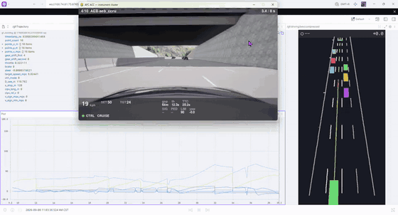
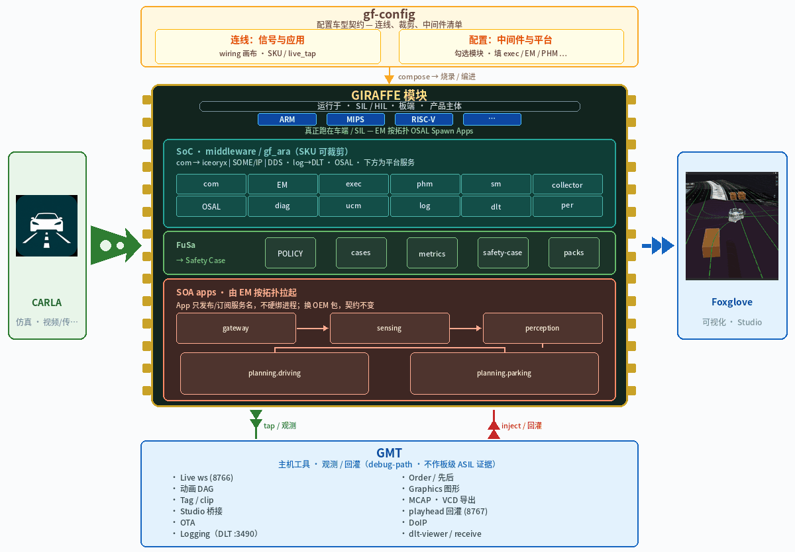
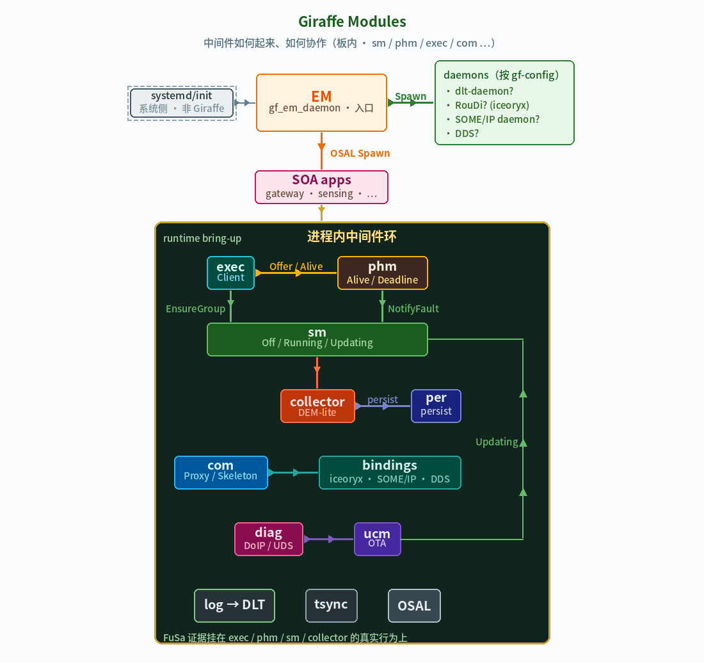
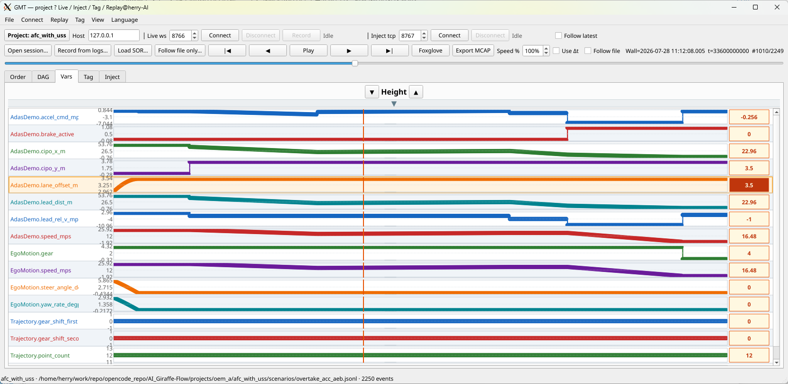

# AI Giraffe Flow

**Lightweight middleware + toolchain for cross-platform SOA systems. Closed-loop virtual world, Foxglove, and CI/CD — see it, stress it, pass it on the bench; the hardware is the last mile.**

可裁剪的 `gf_ara::*` 运行时（**ARM Linux** 优先；OSAL 预留 MIPS / RISC-V）以及配置、生成、观测、上车的配套工具。闭环虚拟世界、Foxglove、CI/CD：台上看见、压住、过门；真机是 last mile。本仓里的感知和规划是 **闭环载荷，不是产品**——给中间件和工具一条诚实的 pub/sub 环，用来量这些：

| 要验证的 | 载荷用来干什么 |
|----------|----------------|
| **健壮性 / 隔离** | 杀掉或饿死一个进程，其余 **hold-last**，控车不断 |
| **时延** | overlay-latest vs wait；端到端一拍；FuSa 时延脚本 |
| **故障定位** | GMT tap + Foxglove：谁在何时发了什么 |
| **回放** | 同一条链上 playhead 回灌 |
| **拉起 / CI/CD** | EM 拓扑与 relaunch；compose → generate → SIL；**过了才 CD**——真机是 last mile |
| **配置保真** | gf-config → SOR；OEM 差异在 gateway/映射，不进业务 App |

OEM 相机/网络权重仍在仓外。

**English:** [README.md](README.md)

<p align="center">
  
</p>

<p align="center">
  <a href="gallery/videos/afc.mp4">完整演示（mp4）</a>
</p>

---

## 总览

| # | 主线 | 角色 | 深入 |
|---|------|------|------|
| **1** | **gf-config** | 工具链 · 配置侧 | [tools/gf-config](tools/gf-config/README_zh.md) · [SOR](docs/zh/architecture/sor-authoring.md) |
| **2** | **Giraffe 模块** | **产品主体** · SOA 运行时、FuSa 证据 | [middleware](middleware/README.md) · [fusa/](fusa/README.md) · [设计](docs/zh/architecture/DESIGN.md) |
| **3** | **GMT** | 工具链 · 观测 / 回灌 / Foxglove | [tools/gmt](tools/gmt/README_zh.md) · [gmt_board](tools/gmt_board/README.md) · [可观测演示](docs/zh/operations/OBSERVABILITY_DEMO.md) |



---

### 1. gf-config（配置侧工具链）

定 **要什么能力、谁连谁、板端裁哪些模块**，不实现算法。两页写回三层资产：

| 页 | 写什么 | 产物 |
|----|--------|------|
| **1 · 信号与应用** | 薄 SKU（`req.yaml`）+ 信号图画布（`wiring.yaml`） | deployments / dataflows / live_tap |
| **2 · 平台运行时** | `runtime_modules` + `platform/*`（exec · **EM 启动表** · PHM · Collector · diag · log · ucm；**per/tsync** 可勾选裁剪） | `platform_manifest` → CMake 裁剪 / EM 拓扑 |

- **Verify / Generate** → SOR + Proxy/Skeleton + lineage（含 `platform_em_launch` 等门禁）


```bash
gf-config projects/afc/project.yaml
```

细节：[tools/gf-config/README_zh.md](tools/gf-config/README_zh.md) · [WORKFLOW](docs/zh/operations/WORKFLOW.md)

---

### 2. Giraffe 模块（主体）

这里是板上和 SIL 里真正跑着的 **中间件**。SKU 里的 FCM、Octave 规划 → Trajectory 是 **载荷**：给 GMT、Foxglove、回灌、PHM、CI 一条诚实的 pub/sub 环，用来验证平台，而不是宣称本仓是量产 ADAS。



#### 2.1 分层

| 层 | 目录 | 做什么 |
|----|------|--------|
| **API / 运行时** | `middleware/` | `gf_ara::*` 对外；`gf::*` 对内；按 SKU `runtime_modules` 裁剪 |
| **传输插件** | `middleware/bindings/` | iceoryx（机内）、SOME/IP、DDS、cross_domain_ipc（MCU） |
| **执行与健康** | exec（**EM daemon**）/ phm / sm / collector | 拓扑拉起、relaunch、心跳、FG、事件收集 |
| **可移植** | `osal/` · `hal/` | 时钟 / 线程 / **进程 Spawn**；主目标 ARM Linux |
| **载荷 App** | `projects/<sku>/apps/` | Gateway / FCM / 规划 — 用来 **压** 平台（`.m` 金源 → C 1:1） |
| **上位机场景** | `carla_scenarios/` | CARLA Client A：布景 + 仪表；另一路压力源，不是控制器 |
| **集成工程** | `projects/` | OEM DBC / wiring / hpp / SIL·HIL / **CI 脚本** |
| **FuSa 证据** | `fusa/` | cases / metrics / Safety Case 骨架（**非证书**） |

公开约定：**业务只依赖 semantic 服务名**；OEM 差异收在 adapter/gateway。详见 [DESIGN](docs/zh/architecture/DESIGN.md)。

#### 2.2 中间件包（按需裁剪）

与架构 GIF 中 Giraffe SoC 芯片对齐（`com` · `EM`∈exec · `exec` · `phm` · `sm` · `collector` · `OSAL` · `diag` · `ucm` · `log` · `per` · `tsync`）。

| 包 | 作用 |
|----|------|
| [com](middleware/com/) | 统一通信抽象（Proxy / Skeleton） |
| [bindings/iceoryx](middleware/bindings/iceoryx/) 等 | 传输后端 |
| [exec](middleware/exec/) | ExecutionClient + **EmDaemon**（OSAL Spawn；GIF 中 `EM`） |
| [phm](middleware/phm/) / [sm](middleware/sm/) / [collector](middleware/collector/) | 健康 / FG / 事件收集 |
| [osal](middleware/osal/) | OS 抽象（含 process；GIF 中 `OSAL`） |
| [diag](middleware/diag/) / [ucm](middleware/ucm/) | DoIP 会话 / OTA 编排（SIL） |
| [log](middleware/log/) | 日志 lite |
| [per](middleware/per/) / [tsync](middleware/tsync/) | 持久化 KV stub / 时间同步骨架（可裁剪） |
| [trace](middleware/trace/) | 时序 → VCD / GMT（偏 debug-path） |

总览：[middleware/README.md](middleware/README.md)

#### 2.3 闭环载荷（示例 SKU）

以 [projects/afc](projects/afc/)（无 USS）为例。用来 **验证** com / EM / 可观测性，不是交付感知或规划产品。规划金源：[octave_planning/](octave_planning/README.md)。

```text
车态源（二选一）
  · gateway（continuous / 无回灌）  或  · inject（playhead，替 gateway）
        │
        ▼ EgoMotion / Perception_In
        ▼
   perception.fcm → Perception_Out     ← 载荷（不是相机网络）
        │
        ▼
   planning.driving → Trajectory       ← 载荷（.m 金源，C 1:1）
        │
        ▼
   gmt_board：tap NDJSON · gf_foxglove_ws :8765
        │
        └─ 时延 / 隔离 / 「谁何时发了什么」 / 回灌复现
```

| 进程 | 角色 |
|------|------|
| `adapter.vehicle_can_gateway` | CAN/仿真 → EgoMotion、Perception_In…（回灌时关闭） |
| `perception.fcm` | Perception_In → Out（载荷；不是相机网络） |
| `planning.driving` | Ego + 感知 → Trajectory（载荷） |
| `gf_iox_obs_tap` | 白名单服务 → NDJSON（GMT 录制） |
| `gf_foxglove_ws` | iceoryx → Foxglove Studio + BEV（`tools/gmt_board`） |
| `gf_iox_obs_inject` | playhead / continuous 回灌 Ego |

SKU 载荷在 `projects/<sku>/apps/`。iceoryx 烟测：`middleware/bindings/iceoryx/testcases/`。

#### 2.4 拉起路径（SIL → 板）

主 SKU `projects/afc`：**mtime compose / 按需 cmake configure / 增量 build**；`GF_CTEST=1` 才跑 ctest；stage 出 `runtime/bin/giraffe_launch`。`projects/adc` 是空槽（未开工）。上位机 CARLA：[carla_scenarios/](carla_scenarios/)。CI：[devops/](devops/README.md)。GMT 旁路为 `GMT_depend_launch`（`GF_GMT_DEPEND=0` → 只 EM）。

```bash
bash projects/afc/scripts/compile_sil.sh

# 普通主链（gateway 开车态）+ 默认挂 GMT depend
bash projects/afc/scripts/run_sil.sh

# 板端 / 同口径 EM：
#   ./projects/afc/build-sil/runtime/bin/giraffe_launch

# 场景回灌（GMT playhead；全量 live 含 Ego → BEV）
GF_INJECT_MODE=playhead GF_INJECT_LIVE=all \
  bash projects/afc/scripts/run_sil.sh

# CI 要测：GF_CTEST=1 bash …/compile_sil.sh
```

脚本：[afc/scripts](projects/afc/scripts/) · [afc README](projects/afc/README.md)  
场景：[carla_scenarios/](carla_scenarios/)

#### 2.5 与工具链的边界

| Giraffe 模块负责 | 不负责（交给工具） |
|------------------|-------------------|
| 进程内算法与 I/O、iceoryx 上真发真收 | 画 wiring / 裁 SKU → gf-config |
| SIL：systemd/init → EM → daemons + App；tap/inject/Foxglove/DoIP 属 **GMT_depend**（非 EM） | Studio / Tag / MCAP；Logging 走 DLT |
| semantic 契约在板上成立 | 离线改 DBC / lineage 会议替代 → compose |
| FuSa 证据（`fusa/`） | GMT 仍属 **debug-path**（不作板级 ASIL 证据） |

#### 2.6 FuSa（属于 Giraffe 模块）

通向 **完整 Safety Case** 的证据入口：L1/L2/L3、隔离、参考延时、Safety Case 骨架。入口：[fusa/](fusa/README.md)。

```bash
bash fusa/scripts/run_cases.sh
GF_FUSA_SIL=1 bash fusa/scripts/run_cases.sh
bash fusa/scripts/measure_latency.sh   # 可选：延时快照
```

---

### 3. GMT（观测侧工具链）

多进程 SIL 联调时，光看终端往往对不齐「谁在何时发了什么」。GMT 把 tap NDJSON 接到本机时间轴：**scrub / 倍速**、**playhead 回灌**、**Tag → MCAP**。**Foxglove 直播**是 C `gf_foxglove_ws`（**:8765**，`tools/gmt_board`）；Python `GMT bridge foxglove` 只做 JSONL 回放。`run_sil` **不起** GMT Live :8766。



| 端口 | 用途 |
|------|------|
| **8765** | Foxglove Studio（`gf_foxglove_ws`；BEV + 模块 I/O） |
| **8766** | GMT GUI live（可选；`run_sil` 不启动） |
| **8767** | playhead 回灌 |

```bash
pip install -e tools/gmt -e 'tools/gmt[gui]'
GMT gui --project projects/afc \
  --session projects/afc/scenarios/overtake_acc_aeb.jsonl
```

细节：[tools/gmt/README_zh.md](tools/gmt/README_zh.md) · [gmt_board](tools/gmt_board/README.md) · [OBSERVABILITY_DEMO](docs/zh/operations/OBSERVABILITY_DEMO.md)

---

## 仓库地图

| 目录 | 用途 |
|------|------|
| [middleware/](middleware/) | **Giraffe 运行时（主体）** |
| [octave_planning/](octave_planning/) | 规划 `.m` 金源（**载荷**，不是产品） |
| [projects/](projects/) | OEM SKU：apps、wiring、SIL·HIL、CI |
| [carla_scenarios/](carla_scenarios/) | 上位机 CARLA 布景 + 仪表 |
| [projects/afc/apps/](projects/afc/apps/) | AFC 载荷（gateway / FCM / 规划） |
| [fusa/](fusa/) | FuSa 证据 |
| [tools/gf-config/](tools/gf-config/) | gf-config |
| [tools/gf-codegen/](tools/gf-codegen/) | gf-codegen |
| [tools/gf-octavecoder/](tools/gf-octavecoder/) | `.m` → C 1:1 |
| [tools/gmt/](tools/gmt/) | GMT 主机 |
| [tools/gmt_board/](tools/gmt_board/) | tap / inject / `gf_foxglove_ws` |
| [devops/](devops/) | 台架 CI → CD last mile（真机） |
| [docs/zh/](docs/zh/README.md) | 文档索引 |

[STRUCTURE.md](STRUCTURE.md) · [ROADMAP](docs/zh/operations/ROADMAP.md)

## 许可证

[LICENSE](LICENSE)
