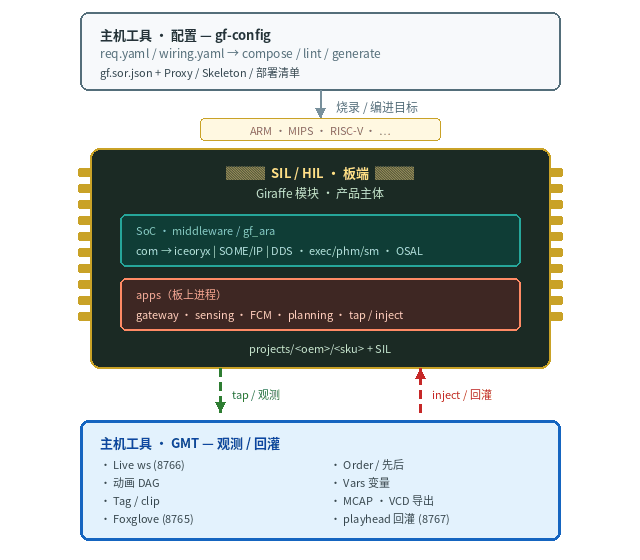

# AI Giraffe Flow

**Lightweight middleware + toolchain for cross-platform SOA systems.**

面向跨平台 SOA：桌面先跑通，嵌入式 **ARM Linux** 优先（OSAL 预留 MIPS / RISC-V）。中间件提供可裁剪的 `gf_ara::*` 运行时与传输绑定；工具链一侧用 **gf-config** 把车型契约编进 SOR/代码生成，另一侧用 **GMT** 把联调从「盯日志猜时序」变成可 scrub、可回灌、可对接 Foxglove 的闭环——核心仍是板上/SIL 里真正跑着的 **Giraffe 模块**。

**English:** [README.md](README.md)

---

## 总览

| # | 主线 | 角色 | 深入 |
|---|------|------|------|
| **1** | **gf-config** | 工具链 · 配置侧 | [tools/gf-config](tools/gf-config/README_zh.md) · [SOR](docs/zh/architecture/sor-authoring.md) |
| **2** | **Giraffe 模块** | **产品主体** · 运行时与进程 | [middleware](middleware/README.md) · [设计](docs/zh/architecture/DESIGN.md) · [示例](projects/oem_a/afc_with_uss/) |
| **3** | **GMT** | 工具链 · 观测侧 | [tools/gmt](tools/gmt/README_zh.md) · [可观测演示](docs/zh/operations/OBSERVABILITY_DEMO.md) |



---

### 1. gf-config（配置侧工具链）

定 **要什么能力、谁连谁**，不实现算法。

- **A 页** → `req.yaml`（SKU / 中间件裁剪 / live_tap）
- **B 页** → `wiring.yaml`（信号图）
- **Verify / Generate** → SOR + 生成代码


```bash
gf-config projects/oem_a/afc_with_uss/project.yaml
```

细节：[tools/gf-config/README_zh.md](tools/gf-config/README_zh.md) · [WORKFLOW](docs/zh/operations/WORKFLOW.md)

---

### 2. Giraffe 模块（主体）

这里是交付到板端、在 SIL 里真正跑起来的部分。业务算法可外仓替换；本仓提供 **可裁剪平台 + 参考进程**，用同一套 semantic 契约联调。

#### 2.1 分层

| 层 | 目录 | 做什么 |
|----|------|--------|
| **API / 运行时** | `middleware/` | `gf_ara::*` 对外；`gf::*` 对内；按 SKU `runtime_modules` 裁剪 |
| **传输插件** | `middleware/bindings/` | iceoryx（机内）、SOME/IP、DDS、cross_domain_ipc（MCU） |
| **执行与健康** | exec / phm / sm | 拉起、心跳、状态组 |
| **可移植** | `osal/` · `hal/` | 时钟/线程等；主目标 ARM Linux |
| **参考 App** | `apps/` | gateway、感知/超声/规划 stub、观测工具——**非量产算法** |
| **集成工程** | `projects/` | OEM 的 DBC / wiring / hpp / SIL·HIL 脚本 |

公开约定：**业务只依赖 semantic 服务名**；OEM 差异收在 adapter/gateway。详见 [DESIGN](docs/zh/architecture/DESIGN.md)。

#### 2.2 中间件包（按需裁剪）

| 包 | 作用 |
|----|------|
| [com](middleware/com/) | 统一通信抽象（Proxy / Skeleton） |
| [bindings/iceoryx](middleware/bindings/iceoryx/) 等 | 传输后端 |
| [exec](middleware/exec/) / [phm](middleware/phm/) / [sm](middleware/sm/) | 执行 / 健康 / 状态 |
| [osal](middleware/osal/) | OS 抽象 |
| [ucm](middleware/ucm/) / [diag](middleware/diag/) | OTA / DoIP 骨架 |
| [log](middleware/log/) / [trace](middleware/trace/) | 日志与时序 |

总览：[middleware/README.md](middleware/README.md)

#### 2.3 参考进程与主链（示例 SKU）

以 [oem_a / afc_with_uss](projects/oem_a/afc_with_uss/) 为例：

```text
车态源（二选一）
  · gateway（continuous / 无回灌）  或  · inject（playhead，替 gateway）
        │
        ▼ EgoMotion
   ┌────┴────┬────────────┐
   ▼         ▼            ▼
  USS      FCM stub    （订 Ego 等）
   │         │
   ▼         ▼
 UssZones   Perception_Out
        \   /
         ▼
      planning → Trajectory
        │
        ▼
   tap → Foxglove / GMT Live
```

| 进程 | 角色 |
|------|------|
| `adapter.vehicle_can_gateway` | CAN/仿真 → EgoMotion、Perception_In…（回灌时关闭） |
| `sensing.uss` | Ego → UssZones |
| `perception.fcm` | Perception_In 或（回灌）Ego → 感知 stub |
| `planning.driving` | Ego（+ 可选感知/USS）→ Trajectory |
| `gf_iox_obs_tap` | 白名单服务 → NDJSON |
| `gf_iox_obs_inject` | playhead / continuous 回灌 Ego |

量产感知/规控在 **外部仓**；本仓 stub 证明契约与联调路径。见 [apps/](apps/README.md)。

#### 2.4 产品路径（SIL）

```bash
# 配置已 Verify / Generate 后：
bash projects/oem_a/afc_with_uss/scripts/compile_sil.sh

# 普通主链（gateway 开车态）
bash projects/oem_a/afc_with_uss/scripts/run_sil.sh

# 场景回灌（GMT playhead；全量 live 含 Ego → BEV）
GF_INJECT_MODE=playhead GF_INJECT_LIVE=all \
  bash projects/oem_a/afc_with_uss/scripts/run_sil.sh
```

脚本与环境变量：[projects/.../scripts/README.md](projects/oem_a/afc_with_uss/scripts/README.md)  
场景（变道→ACC→AEB）：[scenarios/README.md](projects/oem_a/afc_with_uss/scenarios/README.md)

#### 2.5 与工具链的边界

| Giraffe 模块负责 | 不负责（交给工具） |
|------------------|-------------------|
| 进程内算法与 I/O、iceoryx 上真发真收 | 画 wiring / 裁 SKU → gf-config |
| SIL 拉起 RouDi + App + tap/inject | Studio 布局、Tag、MCAP 分析 → GMT / Foxglove |
| semantic 契约在板上成立 | 离线改 DBC / lineage 会议替代 → compose |

---

### 3. GMT（观测侧工具链）

多进程 SIL 联调时，光看终端往往对不齐「谁在何时发了什么」。GMT 把同一条 tap 流接到本机时间轴与 Foxglove：**scrub / 倍速播放**对齐 DAG 与变量轨，**playhead 回灌**按帧把 Ego 灌进主链（gateway 关闭、无双发），需要时再 **Tag → MCAP**。端口少、和 `run_sil` 一条命令配合，日常「改完再看一眼」成本很低——**不替代模块，但让模块可被反复验证**。


| 端口 | 用途 |
|------|------|
| **8765** | Foxglove（模块 I/O → 可选合成 BEV） |
| **8766** | GMT Live（可选旁观） |
| **8767** | playhead 回灌 |

```bash
pip install -e tools/gmt -e 'tools/gmt[gui]'
GMT gui --project projects/oem_a/afc_with_uss \
  --session projects/oem_a/afc_with_uss/scenarios/overtake_acc_aeb.jsonl
```

细节：[tools/gmt/README_zh.md](tools/gmt/README_zh.md) · [OBSERVABILITY_DEMO](docs/zh/operations/OBSERVABILITY_DEMO.md)

---

## 仓库地图

| 目录 | 用途 |
|------|------|
| [middleware/](middleware/) | **Giraffe 运行时（主体）** |
| [apps/](apps/) | 参考 App / adapter / tap·inject |
| [projects/](projects/) | OEM 集成工程 |
| [tools/gf-config/](tools/gf-config/) | gf-config |
| [tools/gf-codegen/](tools/gf-codegen/) | gf-codegen |
| [tools/gmt/](tools/gmt/) | GMT |
| [docs/zh/](docs/zh/README.md) | 文档索引 |

[STRUCTURE.md](STRUCTURE.md) · [ROADMAP](docs/zh/operations/ROADMAP.md)

## 许可证

[LICENSE](LICENSE)
