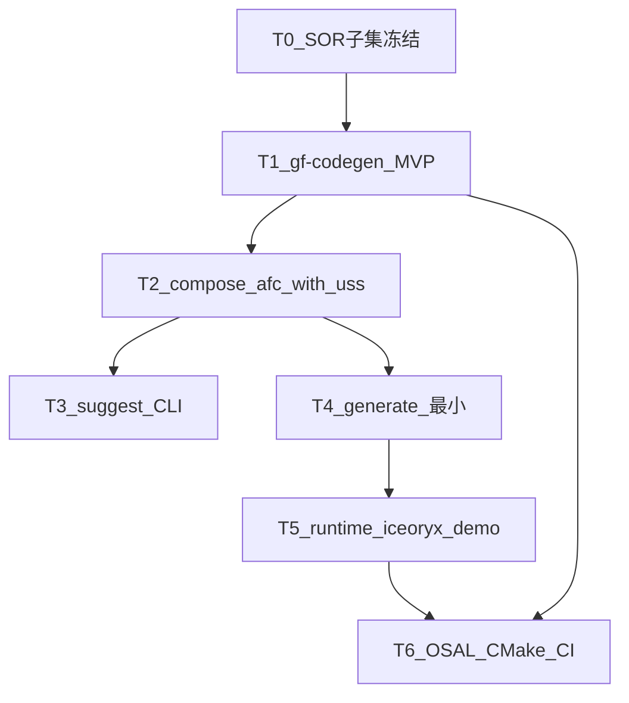

# P0 实施计划（第一版集成导向）

> 路线图：[ROADMAP.md](ROADMAP.md)  
> 集成走查：[afc_with_uss/INTEGRATOR_WALKTHROUGH.md](../../../projects/oem_a/afc_with_uss/INTEGRATOR_WALKTHROUGH.md)  
> 布局：[MODULE_INTERFACE_LAYOUT.md](../../../projects/MODULE_INTERFACE_LAYOUT.md)

**状态（2026-07-13）：P0 收口完成（轨 A / B / C + adc_full compose）。**

| 轨 | 状态 | 要点 |
|----|------|------|
| **A** 主机工具 | ✅ | compose / lint / suggest / types+Proxy/Skeleton generate |
| **B** 运行时 | ✅ | bootstrap、core/com、iceoryx 双进程、generate 接入 demo、OSAL |
| **C** 构建/CI | ✅ | CMake、ctest、`ci/scripts/smoke.sh`、可选 aarch64 link（无交叉工具链则 SKIP） |
| **末刀** | ✅ | `adc_full` compose + lineage + lint + generate（测试已覆盖） |

联调入口：

```bash
pip install -e "tools/codegen[dev]"
bash scripts/bootstrap_deps.sh
bash scripts/verify/oem_a_afc_with_uss/smoke_sil.sh   # SIL 双进程
gf-codegen compose --project projects/oem_b/adc_full/project.yaml
bash ci/scripts/smoke.sh                               # 全量冒烟（含 adc compose）
```

详细规格：[tools/codegen/IMPLEMENTATION.md](../../../tools/codegen/IMPLEMENTATION.md) · 上传清单：[UPLOAD_CHECKLIST.md](../../../projects/UPLOAD_CHECKLIST.md)

**下一步（P1，本文件不再排期）：** 见 [ROADMAP.md](ROADMAP.md) — 三 binding / GMT CLI / MCU gateway 模拟等；勿继续堆 GMT GUI。

---

## 0. 直接回答：要不要先生成 gf-codegen？

| 问题 | 答案 |
|------|------|
| 现在能跑 `compose` 吗？ | **能。** `afc_with_uss` 与 `adc_full` 均已通。 |
| 第一版集成工具侧完成定义？ | **已达成**（compose + lineage；SIL iceoryx 闭环）。 |
| 下一步？ | **P1**（见 ROADMAP），非继续扩 P0 范围。 |

```text
已完成：  轨 A + 轨 B + 轨 C + adc_full compose/generate     ✅
下一阶段： P1（SOME/IP·DDS / GMT CLI / MCU 模拟 …）
```

---

## 1. 总策略（切片，避免一次做完整个平台）

P0 拆成 **三条轨**，共享契约（SOR 0.2 子集），但**交付顺序**如下：



| 轨 | 内容 | 与「第一版集成」关系 |
|----|------|----------------------|
| **A. 主机工具** | `lint` → `compose` → `suggest` → `generate` | **主路径；先做** |
| **B. 运行时** | `core` Result、`com` Event、iceoryx、RouDi、双进程 | compose/generate 之后才能闭环演示 |
| **C. 构建/CI** | CMake desktop + aarch64 交叉 link | 与 B 同步，验收桌面冒烟 + 交叉 link |

**原则：** `afc_with_uss` 为 SIL 双进程验收项目；`adc_full` 为完整拓扑 compose/generate 验收（P0 末刀已覆盖）。

---

## 2. 轨 A — gf-codegen 实施策略（详细）

### 2.1 技术默认（已拍板）

| 项 | 选择 |
|----|------|
| 语言 | **Python 3** CLI（板上不装） |
| 包布局 | `tools/codegen/`（`pyproject.toml` 或可 `pip install -e`） |
| 入口 | 控制台脚本 `gf-codegen` |
| DBC | **cantools**（主机依赖，P0 为 compose/import 提前启用） |
| YAML/JSON | PyYAML + json；对照 `schemas/gf.sor.schema.json` |
| hpp 解析 | P0：**正则/简易 Clang 无关解析**（只抽 `struct` 名与字段类型）；复杂宏/模板不支持 |
| 不做 | GUI、ARXML、完整 C++ AST、把 codegen 打进板端镜像 |

### 2.2 命令交付顺序（必须按此切片）

| 步 | 命令 | 最小行为 | 验收 |
|----|------|----------|------|
| A1 | `gf-codegen --help` | 入口可装可跑 | ✅ |
| A2 | `gf-codegen lint <sor.json>` | 读 JSON + 对照 schema 必填字段 | ✅ |
| A3 | `gf-codegen compose --project <project.yaml>` | compose 管道 | ✅ afc + adc |
| A4 | `gf-codegen suggest wiring --project ...` | 打印建议 YAML 片段 | ✅ |
| A5 | `gf-codegen generate <sor.json> --out generated/` | types + Proxy/Skeleton | ✅ |

### 2.3 `compose --project` 内部管道

读取项目 `project.yaml`：

```text
1. load project.yaml
2. load base SOR（desktop_ap_only 或空骨架）
3. import oem → DBC + manifest
4. parse interfaces/*.hpp
5. apply integration/wiring.yaml
6. merge req.yaml
7. write out + lineage_check
```

### 2.4 建议目录与详细规格

[tools/codegen/IMPLEMENTATION.md](../../../tools/codegen/IMPLEMENTATION.md)

### 2.5 第一版集成验收清单（compose）

- [x] `compose` afc_with_uss 退出码 0  
- [x] 产出含 EgoMotion / UssZones / FrontObjectList / Trajectory  
- [x] lineage 报告 `ok=True`  
- [x] `adc_full` compose + lineage + generate（P0 末刀）  
- [x] 文档命令与真实 CLI 一致  
- [ ] （可选）人工审定后写入 `golden/gf.sor.json` — demo 默认不随仓提交，见各项目 `golden/README.md`

---

## 3. 轨 B — 运行时（✅）

| 步 | 交付 | 状态 |
|----|------|------|
| B1 | `gf_ara::core` Result/ErrorCode | ✅ |
| B2 | `gf_ara::com` Event + iceoryx binding | ✅ |
| B3 | 双进程 demo + RouDi | ✅ `smoke_sil.sh` |
| B4 | generate 接入 demo | ✅ `GF_USE_GENERATED` |
| B5 | OSAL + CI/交叉脚本 | ✅ |

---

## 4. 轨 C — CMake / CI（✅）

| 步 | 内容 | 状态 |
|----|------|------|
| C1 | 根 CMake + desktop | ✅ |
| C2 | OSAL POSIX | ✅ |
| C3 | CI smoke：pytest + compose(afc+adc) + ctest + SIL | ✅ `ci/scripts/smoke.sh` |
| C4 | aarch64 交叉 link | ✅ 脚本就绪；无工具链则 SKIP |

HIL：`compile_hil.sh` 需 `aarch64-linux-gnu-g++`；`run_hil` / `deploy_hil` 仍为 P0 stub。

---

## 5. 明确不在 P0（避免范围膨胀）

- GMT GUI / 拖拽写回 wiring  
- SOME/IP、DDS、MCU 真机、OTA/DoIP 实装  
- 把全量 OEM 通信矩阵直接当 compose 输入  
- 模块侧再出 JSON fragment  

---

## 6. 里程碑对照（已完成）

| 里程碑 | 产出 | 状态 |
|--------|------|------|
| M0–M3 | schema 子集 + lint/compose/suggest | ✅ |
| M4 | generate + iceoryx 双进程 | ✅ |
| M5 | CMake/OSAL/CI + adc_full | ✅ |

---

## 7. 你现在可以做什么

1. 本地跑 `bash ci/scripts/smoke.sh` 或分步验证（见文首命令）  
2. 审 `adc_full` / `afc_with_uss` 的 wiring 与 lineage 报告  
3. 进入 **P1** 前先选主线：通信 binding / GMT CLI / MCU 桌面联调  

---

## 附录 A — afc_with_uss 输入清单

| 文件 | 角色 |
|------|------|
| `project.yaml` | 索引 |
| `oem/oem_import.dbc` + `oem_import.yaml` | OEM |
| `interfaces/**/io_types.hpp` | 模块类型 |
| `integration/wiring.yaml` | 连线 |
| `req.yaml` | SKU / 验收 / 观测与 apps |

## 附录 B — 依赖（主机 vs 板）

| 用途 | 库 | 阶段 |
|------|-----|------|
| codegen | Python3、PyYAML、cantools、jsonschema | P0 主机 |
| runtime IPC | iceoryx + RouDi（`middleware/third_party`） | P0 |
| 延后 | vsomeip、CycloneDDS、MCAP | P1+ |
