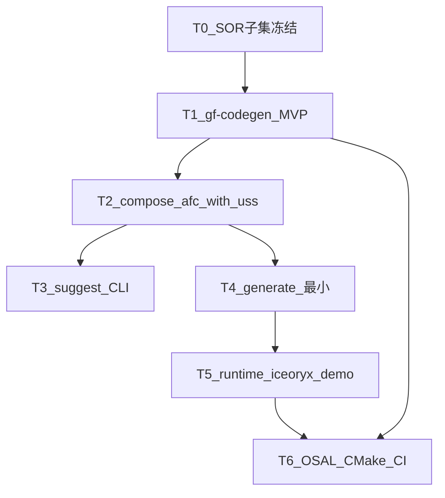

# P0 实施计划（第一版集成导向）

> 路线图：[ROADMAP.md](ROADMAP.md)  
> 集成走查：[afc_with_uss/INTEGRATOR_WALKTHROUGH.md](../../../projects/oem_a/afc_with_uss/INTEGRATOR_WALKTHROUGH.md)  
> 布局：[MODULE_INTERFACE_LAYOUT.md](../../../projects/MODULE_INTERFACE_LAYOUT.md)

**状态（2026-07-10）：**  
- 集成输入与 **`gf-codegen` MVP 已落地**（`compose` / `lint` / `suggest` / 类型头 `generate`）。  
- 验收项目：`projects/oem_a/afc_with_uss`（含 `golden/`）。  
- **下一步：** P0 轨 B — iceoryx 双进程 + generate 增强（Proxy/Skeleton）；见下文轨 B/C。

快速命令：

```bash
pip install -e "tools/codegen[dev]"
gf-codegen compose --project projects/oem_a/afc_with_uss/project.yaml
```

详细规格：[tools/codegen/IMPLEMENTATION.md](../../../tools/codegen/IMPLEMENTATION.md) · 上传清单：[UPLOAD_CHECKLIST.md](../../../projects/UPLOAD_CHECKLIST.md)

---

## 0. 直接回答：要不要先生成 gf-codegen？

| 问题 | 答案 |
|------|------|
| 现在能跑 `compose` 吗？ | **能。** 见上方命令。 |
| 第一版集成工具侧完成定义？ | `afc_with_uss`：compose + lineage ok + golden 已写入。 **已达成。** |
| 下一步？ | 轨 B runtime（iceoryx / RouDi / 双进程），而非继续堆 GMT GUI。 |

```text
已完成：  projects/oem_a/afc_with_uss + tools/codegen MVP     ✅
进行中：  generate 仅 types；缺 Proxy/Skeleton、iceoryx demo   → 轨 B
```

---

## 1. 总策略（切片，避免一次做完整个平台）

P0 拆成 **三条轨**，共享契约（SOR 0.2 子集），但**交付顺序**如下：



| 轨 | 内容 | 与「第一版集成」关系 |
|----|------|----------------------|
| **A. 主机工具** | `lint` → `compose` → `suggest` → `generate` | **主路径；先做** |
| **B. 运行时** | `core` Result、`com` Event、iceoryx、RouDi、双进程 | compose/generate 之后才能闭环演示 |
| **C. 构建/CI** | CMake desktop + aarch64 交叉 link | 与 B 同步，验收桌面冒烟 + 交叉 link |

**原则：** 用 `afc_with_uss` 当 **compose 的唯一验收项目**（输入小、拓扑 `ap_only`、无 MCU）；`adc_full` 的 golden 仅作完整 SOR 样例对照，不要求 P0 第一刀就 compose 通 ADC。

---

## 2. 轨 A — gf-codegen 实施策略（详细）

### 2.1 技术默认（已拍板）

| 项 | 选择 |
|----|------|
| 语言 | **Python 3** CLI（板上不装） |
| 包布局 | `tools/codegen/`（`pyproject.toml` 或可 `pip install -e`） |
| 入口 | 控制台脚本 `gf-codegen` |
| DBC | **cantools**（主机依赖，P0 为 compose/import 提前启用） |
| YAML/JSON | PyYAML + json；对照 `schemas/gf.sor.schema.json` |
| hpp 解析 | P0：**正则/简易 Clang 无关解析**（只抽 `struct` 名与字段类型）；复杂宏/模板不支持 |
| 不做 | GUI、ARXML、完整 C++ AST、把 codegen 打进板端镜像 |

### 2.2 命令交付顺序（必须按此切片）

| 步 | 命令 | 最小行为 | 验收 |
|----|------|----------|------|
| A1 | `gf-codegen --help` | 入口可装可跑 | `pip install -e tools/codegen` 后有命令 |
| A2 | `gf-codegen lint <sor.json>` | 读 JSON + 对照 schema 必填字段 | 对 `adc_full/golden/gf.sor.json` 与 `desktop_ap_only` 不崩；缺字段报错 |
| A3 | `gf-codegen compose --project <project.yaml>` | 见下节 **compose 管道** | **对 `afc_with_uss` 写出 `gf.sor.json` + lineage 报告** |
| A4 | `gf-codegen suggest wiring --project ...` | 打印建议 YAML 片段（不写盘或 `--write` 可选） | 对 afc_with_uss 能给出 EgoMotion/UssZones 等候选 |
| A5 | `gf-codegen generate <sor.json> --out generated/` | 最小 C++ Proxy/Skeleton 或类型头 | 生成物可被后续 demo 引用（可先极简） |

**明确：A3 是第一版集成的里程碑；A4/A5 紧随，但不可阻塞「先能 compose」。**

### 2.3 `compose --project` 内部管道（针对 afc_with_uss）

读取 [`project.yaml`](../../../projects/oem_a/afc_with_uss/project.yaml)：

```text
1. load project.yaml
2. load base SOR（desktop_ap_only 或空骨架）
3. import oem:
     - 读 oem/oem_import.dbc（cantools）
     - 应用 oem/oem_import.yaml（白名单 / module_owned / gateway provides）
     - 产出 imports_meta + adapter_mappings + 相关 types/services
4. parse interfaces/*.hpp（wiring.modules[].hpp）
     - 抽出 struct → types[]
5. apply integration/wiring.yaml
     - deployments / bindings / dataflows
     - 合并 semantic 服务 ID
6. merge req.yaml
     - topology、runtime_modules、bindings、acceptance.required_services
7. write out（默认项目目录或 project.out）
8. lineage_check → reports/signal_lineage_report.yaml
     - fail_on_error 时非 0 退出
```

**P0 lineage 最小检查（afc_with_uss 够用）：**

1. 每个 `requires` 至少有一个 `provides`  
2. `dataflows` 端点 process 存在于 deployments  
3. `required_services`（req.yaml）均出现在 services/semantic  
4. `module_owned` 的 PDC/USS 未出现在「gateway 逐帧 mapping」冲突中（警告或错误）

**P0 故意简化：**

- 不解析全量 OEM 矩阵；只吃项目内 `oem_import.dbc`  
- planning 无 hpp 时：仅按 wiring 的 `package` + deployments 建 process 节点（类型可先引用已有 Trajectory 占位或从 base 来）  
- 不实现 GMT 画布  

### 2.4 建议目录与详细规格

**完整实施说明书（包结构、逐步算法、验收对照）：**  
[tools/codegen/IMPLEMENTATION.md](../../../tools/codegen/IMPLEMENTATION.md)

```text
tools/codegen/
  pyproject.toml
  IMPLEMENTATION.md     # 详细规格
  src/gf_codegen/       # cli + compose/* + lint/suggest/generate
  tests/
```

### 2.5 第一版集成验收清单（compose）

- [ ] `gf-codegen compose --project projects/oem_a/afc_with_uss/project.yaml` 退出码 0  
- [ ] 产出 `gf.sor.json`（或 project 声明的 `out`）含：EgoMotion、UssZones、FrontObjectList、Trajectory 相关服务与 deployments  
- [ ] `reports/signal_lineage_report.yaml` 无 error（或仅约定 warning）  
- [ ] 人工评审后写入 `projects/oem_a/afc_with_uss/golden/gf.sor.json`，并在 `req.yaml` 填 `acceptance.sor_golden`  
- [ ] 文档命令与真实 CLI 一致  

---

## 3. 轨 B — 运行时（compose 之后，仍属 P0）

| 步 | 交付 | 依赖 |
|----|------|------|
| B1 | `gf_ara::core` Result/ErrorCode | 无三方 |
| B2 | `gf_ara::com` Event 子集 + `bindings/iceoryx` | **iceoryx** FetchContent；同工具链 |
| B3 | 双进程 demo（publish/subscribe） | RouDi 先起（**平台 daemon**，OEM 主图不画） |
| B4 | `generate` 输出接入 demo | A5 |

RouDi：仅开发/部署可见；由启动脚本或日后 EM 拉起。详见沟通结论（隐藏在 gf_ara 使用方式之后）。

**板端依赖（P0）：** iceoryx、（可选）nlohmann/json；不上 vsomeip/DDS。  
**交叉编译：** desktop 冒烟 + aarch64 **link** 通过（可不实板）；iceoryx 与本仓同 `CMAKE_TOOLCHAIN_FILE`。

---

## 4. 轨 C — CMake / CI

| 步 | 内容 |
|----|------|
| C1 | 根 `CMakeLists.txt` + `GF_OSAL_ARCH` + desktop profile |
| C2 | OSAL：单调时钟 + 线程（POSIX） |
| C3 | CI：`gf-codegen lint` + `compose afc_with_uss` +（有则）golden diff；runtime 单测冒烟 |
| C4 | CI job：aarch64 交叉 **compile/link**（无实板跑） |

---

## 5. 明确不在 P0（避免范围膨胀）

- GMT GUI / 拖拽写回 wiring  
- 完整 `adc_full` compose 对齐（可作 P0 末或 P1）  
- SOME/IP、DDS、MCU 真机、OTA/DoIP 实装  
- 把全量 OEM 通信矩阵直接当 compose 输入  
- 模块侧再出 JSON fragment  

---

## 6. 建议排期（相对顺序，非日历）

| 里程碑 | 产出 | 约序 |
|--------|------|------|
| **M0** | SOR 0.2 子集字段表（compose 输出必须含哪些键）写进本文件附录或 schema 注释 | 0.5～1 天 |
| **M1** | `gf-codegen` 可安装 + `lint` | 1～2 天 |
| **M2** | `compose` 打通 `afc_with_uss` + lineage | **3～5 天（第一版集成核心）** |
| **M3** | `suggest` CLI + 本项目 golden 落盘 | 1～2 天 |
| **M4** | `generate` 最小 + iceoryx 双进程 + RouDi 脚本 | 3～5 天 |
| **M5** | CMake/OSAL/CI（含 aarch64 link） | 2～3 天 |

---

## 7. 你现在可以做什么（工具未就绪时）

1. 继续审 [`afc_with_uss`](../../../projects/oem_a/afc_with_uss/) 的 wiring / DBC / interfaces（输入质量）  
2. 确认 Trajectory 等无 hpp 的 process：P0 用占位类型还是补一份 `interfaces/planning_driving/io_types.hpp`  
3. 同意本计划后：**下一对话开始实现轨 A（Python gf-codegen）**  

---

## 附录 A — afc_with_uss 输入清单（compose 只读这些）

| 文件 | 角色 |
|------|------|
| `project.yaml` | 索引 |
| `oem/oem_import.dbc` + `oem_import.yaml` | OEM |
| `interfaces/uss_sensing/io_types.hpp` | USS |
| `interfaces/perception_front/io_types.hpp` | 前视 |
| `integration/wiring.yaml` | 连线 |
| `req.yaml` | SKU / 验收 |
| `schemas/examples/desktop_ap_only.sor.json` | base（可逐步换成更空的骨架） |

## 附录 B — 依赖（主机 vs 板）

| 用途 | 库 | 阶段 |
|------|-----|------|
| codegen compose/lint | Python3、PyYAML、cantools、jsonschema（建议） | P0 主机 |
| runtime IPC | iceoryx + RouDi | P0 板/桌面 |
| 可选 | nlohmann/json | P0 |
| 延后 | vsomeip、CycloneDDS、MCAP、CLI11（若坚持 Python 则可不拉） | P1+ |
