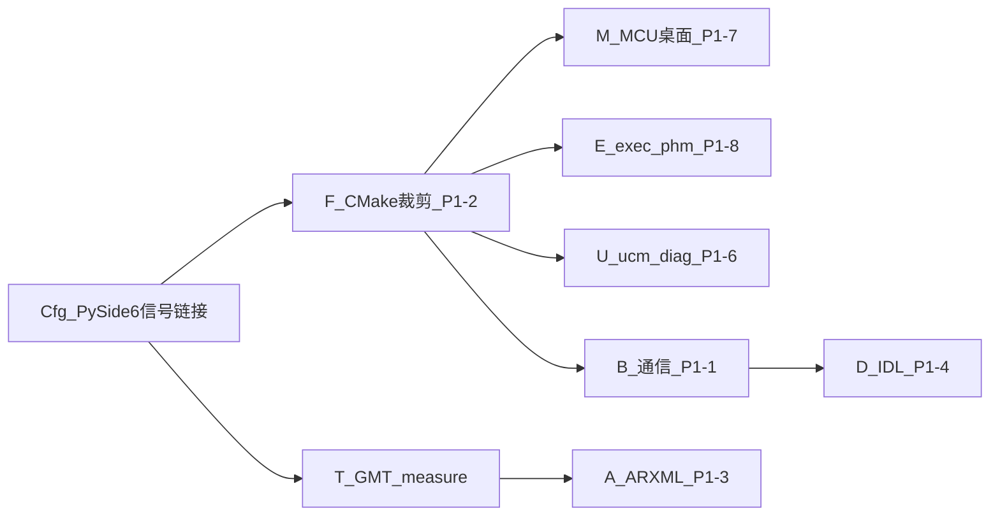

# P1 实施计划

> 路线图：[ROADMAP.md](ROADMAP.md) · P0 已收口：[P0_PLAN.md](P0_PLAN.md)  
> 配置 UI 讨论定稿：主机 **PySide6**；**A+B**（req + wiring）；**信号链接 GUI 为 P1 必做**

**状态（2026-07-13）：** 计划定稿；`gf-config` MVP 开工（可打开项目体验表单 + 连线图雏形）。

---

## 0. 目标与原则

- SKU 可裁剪、MCU 桌面可联调、中间件 stub 可链  
- **集成连线用人看图，不用 CLI 主改 wiring**  
- 配置 GUI **只编辑** `req.yaml` / `wiring.yaml` → `compose` → lineage；不上板  

---

## 1. 子轨与顺序



| 子轨 | 内容 | 优先级 |
|------|------|--------|
| **Cfg** | `gf-config`：SKU 表单 + **信号链接画布**写回 wiring + lineage | **P1 先体验** |
| **F** | `req.runtime_modules` / bindings → CMake 裁剪 | 高 |
| **M** | mcu.cp_gateway + cp_ipc_peer 桌面 | 高 |
| **E / U** | exec/phm 最小；ucm/diag stub 可链 | 中 |
| **B / D** | CycloneDDS 或 vsomeip 分期；IDL 仅随 DDS | 中后 |
| **T / A** | GMT measure MCAP 雏形；ARXML import | 后 |

---

## 2. Cfg — gf-config（唯一作者 GUI；原 GMT architect 画布已迁此）

### 2.1 交付

| 项 | 说明 |
|----|------|
| 包 | [`tools/config/`](../../../tools/config/)（入口 `gf-config`） |
| 技术 | Python ≥3.10 + **PySide6**（host_tools，不上板） |
| 页签 A | 编辑 `req.yaml`（runtime_modules / bindings / observability / apps） |
| 页签 B | **信号链接图（类 Simulink）**：端口 + 拖线 + 右键增删节点 → 写回 `wiring.yaml` |
| 页签 C | lineage 报告；红项可提示 |
| 动作 | 保存 → `gf-codegen compose` → 刷新图/报告 |
| GMT | 只读 `gmt architect` CLI（CI）+ 后期 measure；**不做作者画布** |

### 2.2 验收

- [ ] 打开 `afc_with_uss` 可见连线图  
- [ ] 改边保存后 `wiring.yaml` 更新且 compose/lineage 可用  
- [ ] 改 req 勾选写回  
- [ ] CI 不强制跑 Qt  

### 2.3 P1 不做

Vector 级工程树、板端 GUI、以 `gf.sor.json` 为手改真相、Foxglove 深度（P2）

---

## 3. 其余子轨（摘要）

见原 ROADMAP P1-1…P1-8；通信默认 **CycloneDDS**（ROS 2 侧对齐 `rmw_cyclonedds_cpp`）；SOME/IP 分期。

---

## 4. 明确不做（P1）

- GMT 完整 measure/Foxglove（P2）  
- 真 MCU / 真 DoIP 台架 / OTA 后端落地  
- 同时完整交付 SOME/IP **与** 两套 DDS  

---

## 5. 你怎么体验（Cfg MVP）

```bash
cd /path/to/AI_Giraffe-Flow
source .venv/bin/activate
pip install -e "tools/codegen[dev]"
pip install -e "tools/config"
gf-config projects/oem_a/afc_with_uss/project.yaml
```
