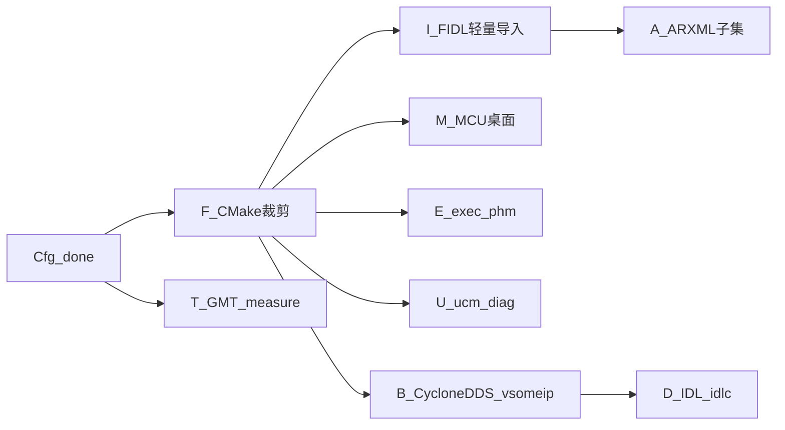

# P1 实施计划

> 路线图：[ROADMAP.md](ROADMAP.md) · P0 已收口：[P0_PLAN.md](P0_PLAN.md)  
> 配置 UI：主机 **PySide6** · `gf-config` · 信号链接 GUI

**状态（2026-07-15）：** **P1 子轨全部交付（Cfg · F · I · M · E/U · B/D · T/A）**。下一阶段见 **[P2_PLAN.md](P2_PLAN.md)**（真正可运行）。  
**Review：** 请按 [P1_REVIEW_CHECKLIST.md](P1_REVIEW_CHECKLIST.md)（R0–R7）逐项验收后再改。

---

## 0. 目标与原则

- SKU 可裁剪、MCU 桌面可联调、中间件 stub 可链  
- **集成连线用人看图**（`gf-config`），CLI 只做 compose/CI  
- 只编辑 `req.yaml` / `wiring.yaml` → compose → SOR / lineage；**不上板**  
- 接口导入：**hpp 已有** · **FIDL 轻量进 P1** · ARXML 子集稍后；**不做 IoNAS / Classic CP 互转**  
- FIDL→ARXML 完整转换若需要，**外挂 FARACON**（可选），不在 GUI 重写  

---

## 1. 子轨与顺序（开工用）



| 顺序 | 子轨 | 内容 | 状态 |
|------|------|------|------|
| 0 | **Cfg** | `gf-config` A/B/C | **已交付** |
| 1 | **F** | `req.runtime_modules` / `bindings` → CMake 裁剪 | **已交付** |
| 2 | **I** | 轻量 **FIDL** 导入 → wiring 端口候选（`gf-codegen` + `gf-config`） | **已交付**（导出后置） |
| 3 | **M** | `mcu.cp_gateway` + `cp_ipc_peer` 桌面联调 | **已交付** |
| 4 | **E / U** | exec/phm 最小；ucm/diag stub 可链 | **已交付** |
| 5 | **B / D** | CycloneDDS（默认）/ vsomeip 分期；IDL→idlc | **已交付**（真 Cyclone/vsomeip 源码可后置） |
| 6 | **T / A** | GMT measure MCAP 雏形；ARXML 子集 import | **已交付** |

---

## 2. Cfg — 已交付（摘要）

| 项 | 说明 |
|----|------|
| 入口 | `gf-config` · [`tools/config/`](../../../tools/config/) |
| A | 完整 `req.yaml`（含 acceptance） |
| B | 类 Simulink：端口 / 拖线 / 布局保持 / hpp / 搜索 |
| C | lineage 失败标红 |
| 分工 | **req** = SKU 契约；**wiring** = 进程连线 |

验收见 §2.2（均已勾选）。**P1 不做：** Vector 工程树、板端 GUI、手改 SOR、Foxglove 深度、**IoNAS**。

### 2.2 验收

- [x] 打开 `afc_with_uss` 可见连线图  
- [x] 改边保存后 wiring 更新且 compose/lineage 可用  
- [x] 改 req 写回  
- [x] C 页红项  
- [x] CI 不强制跑 Qt  

---

## 3. I — FIDL / FDEPL（新纳入 P1 · 澄清）

### 3.0 `.fidl` 与 `.fdepl` 是什么（对照我们已有概念）

| Franca | 含义 | **不是** | 我们仓里接近的东西 |
|--------|------|----------|-------------------|
| **`.fidl`** | **逻辑接口**：interface / method / broadcast / struct（与传输无关） | 不是「用哪条总线」 | `wiring` 的 provides/requires、types；现有 **hpp** 同级 |
| **`.fdepl`** | **部署参数**：把上述接口「落到某中间件」时的细节（CommonAPI 上多为 **SOME/IP**：ServiceID / InstanceID / MethodID / EventID、端口等） | **不是** `req.bindings` 里的 iceoryx/dds 勾选 | 暂无对等字段；以后可挂在 wiring 的 deployment/binding 扩展，或 SOME/IP 生成配置 |

**你的猜测「fdepl ≈ iceoryx/dds」——不完全对。**

- `req.bindings: [iceoryx, dds, someip]` = **SKU 裁剪：镜像里编进哪些通信栈**（CMake / F 轨）。  
- `.fdepl` = **某个接口在选定栈上的实例化参数**（尤其 SOME/IP 数字 ID）。  
- iceoryx / DDS **通常不用 Franca fdepl**；fdepl 是 CommonAPI 生态里跟 **SOME/IP（或 D-Bus 等）binding** 成对出现的。  
- 我们画布上的 **dataflow（谁连谁）** 解决的是拓扑，也**不能**代替 ServiceID 这类 fdepl 内容。

### 3.0b 接口语言 ↔ 中间件（学习结论 · 已纳入计划）

| 制品 | 生态常见配对 | 在本仓的角色 | 备注 |
|------|--------------|--------------|------|
| **Franca `.fidl`** | CommonAPI → 常配 **SOME/IP**（再加 `.fdepl`） | **逻辑接口**导入（与 hpp 同级）→ wiring / types | `.fidl` 本身**不绑定**传输；我们也可只当类型/端口源 |
| **Franca `.fdepl`** | **SOME/IP** ServiceID / InstanceID / … | `parse_fdepl` → 配置/文档；**≠** `req.bindings` | 跟 vsomeip 用 |
| **OMG `.idl`** | **DDS**（CycloneDDS `idlc`） | `gf-codegen emit-idl` ← SOR types | **不是** Franca FIDL |
| **`req.bindings`** | iceoryx / dds / someip | CMake 编进哪些栈 | SKU 裁剪，与上述文件正交 |

**简记（工具链配对，可写进培训）：**

```text
SOME/IP 路径：  .fidl（逻辑） + .fdepl（部署 ID） → vsomeip / CommonAPI
DDS 路径：      SOR types → .idl → cyclonedds idlc
iceoryx 路径：  hpp / fidl 进 SOR types → iceoryx binding（不用 fdepl / 不用 OMG idl）
```

因此：**「fidl 针对 some/ip、idl 针对 dds」作为本仓默认配对是对的**；更精确说法是 **fidl=逻辑接口（SOME/IP 常用入口），fdepl=SOME/IP 部署，idl=DDS 类型**。已写入本计划，不必另开子轨。

因此：P1 已做 `.fidl` **导入** + `.fdepl` 轻量读 + `.idl` 发射；完整 CommonAPI 生成器不做。

### 3.1 目标与分工

**目标：** `.fidl` 经 **gf-config 导入并整理信号** 后写回 wiring，再 **保存自动 compose**（CI：`python -m gf_codegen.compose`）；与 hpp 同级。不做 IoNAS；不在 GUI 内嵌 FARACON。

```text
.fidl → gf-config（导入 + 画布整理）→ wiring.yaml → 保存/compose → SOR / lineage
              ↑
         parse_fidl（库，住在 codegen 包内）

.fdepl →（P1 后半 / 随 B·vsomeip）可选解析 ServiceID 等 → wiring 扩展或 someip 配置
              不阻塞 I 轨前半与 F/M

导出（wiring/SOR → .fidl / .fdepl）→ 后置可选；P1 不做
```

| 项 | 说明 |
|----|------|
| **用户入口** | `gf-config` B 页「导入 fidl…」（与「导入 hpp」并列） |
| **解析库** | `gf_codegen.compose.parse_fidl` |
| **解析范围（P1 前半）** | `interface` / `struct` / `method` / `broadcast` → 端口候选 |
| **写回** | `wiring.modules[].fidl` + 用户勾选的 provides/requires；连线仍写 `dataflows` |
| **导出** | **不做（P1）**：不从 wiring/SOR 生成 `.fidl` / `.fdepl`；若以后需要，`.fdepl` 导出依赖 SOME/IP ID 模型（B/vsomeip） |
| **`.fdepl`（P1 后半，挂钩 B）** | 仅当走 CommonAPI/SOME/IP 时：轻量**读入** ServiceID/InstanceID 等 → 文档化映射到 vsomeip/生成配置；**可不做完整 CommonAPI 生成器** |
| **可选后置** | 外调 FARACON → ARXML → A 轨 |
| **不做（P1）** | IoNAS；GUI 内嵌 Artop；用 fdepl「代替」req.bindings；**导出 fidl/fdepl** |

**验收：**

- [x] `gf-config` 可导入 `.fidl`、勾选端口、整理连线并 Save  
- [x] Compose 合并 `modules[].fidl` 中的 struct → types  
- [x] `parse_fidl` 单测 + 样例 `interfaces/demo_fidl/VehicleStatus.fidl`  
- [x] （后半可选）样例 `.fdepl` 能读出 SOME/IP ID 并写入约定 YAML 字段 / 文档  
- [ ] （后置）导出 `.fidl` / `.fdepl`（非 P1）  

---

## 4. 其余子轨（你要做什么）

### F — CMake 裁剪（P1-2 · 已落地骨架）

- [x] `req.runtime_modules` / `bindings` / `apps` → compose 写出 `generated/gf_build.cmake`  
- [x] 根 CMake `include(GfModules)` 按 SKU 加 binding/apps；未知模块无 CMakeLists 则跳过  
- [x] 低配 profile：`cmake/profiles/desktop_minimal.cmake`（仅 demo_pipeline，无 uss_feed）  
- [x] `compile_sil/hil` 传 `-DGF_SKU_CMAKE=.../gf_build.cmake`  
- [x] 文档：SKU 勾选 ↔ CMake 对应表（见下表）  

| req 字段 | CMake |
|----------|--------|
| `runtime_modules` | 可选 `middleware/<mod>`（有 CMakeLists 才加）；core/com/osal 常开 |
| `bindings: iceoryx` | `GF_WITH_ICEORYX` + `bindings/iceoryx` |
| `bindings: someip/dds/...` | `GF_WITH_*`；无实现则 STATUS skip |
| `apps` | `add_subdirectory(apps/...)` |

### M — MCU 桌面（已交付）

- [x] `mcu.cp_gateway` + `cp_ipc_peer` 桌面可跑（Unix socket / `cross_domain_ipc`）  
- [x] `adc_full` 联调脚本无真 MCU：`projects/oem_b/adc_full/scripts/smoke_mcu_desktop.sh`  
- [x] profile：`cmake/profiles/mcu_desktop.cmake`（无 iceoryx）  
- [x] 补回 `cmake/GfModules.cmake` + desktop profiles（F 轨消费端）

### E / U（已交付）

- [x] exec + phm Alive/Deadline 最小闭环（`gf_phm_alive_deadline_smoke`）  
- [x] ucm PackageManager 状态机 stub + SM/PHM 钩子文档  
- [x] diag DoIP Initialize/Shutdown（+ TesterPresent 探针）stub 可链  
- [x] profile / 脚本：`cmake/profiles/eu_stub.cmake` · `scripts/smoke_eu_stub.sh` 

### B / D（已交付 · 离线 stub + 工具链）

- [x] CycloneDDS binding **可选编译**（默认厂商；offline 用 stub 后端，`GF_WITH_DDS`）  
- [x] vsomeip **分期** stub 可链（`GF_WITH_SOMEIP`；真 vsomeip+Boost 后置）  
- [x] 轻量读 `.fdepl` SOME/IP ID（`parse_fdepl` + 样例）；**不**用 fdepl 代替 `req.bindings`  
- [x] SOR types → IDL（`gf-codegen emit-idl`）+ `scripts/run_idlc.sh`（无 idlc 则 SKIP）  
- [x] profile / 脚本：`cmake/profiles/bd_stub.cmake` · `scripts/smoke_bd_stub.sh` 

### T / A（已交付）

- [x] GMT `architect lineage|dag` CI 只读（`tools/gmt` · **`GMT` CLI**）  
- [x] `GMT measure export` JSONL → MCAP 雏形（无 Foxglove 桥）  
- [x] ARXML 子集 import：`gf-codegen import arxml` + `parse_arxml`（可消费 FARACON 产出）  
- [x] 样例：`schemas/examples/oem/demo_faracon_subset.arxml`  
- [x] 脚本：`scripts/smoke_ta.sh`；CI `smoke.sh` 已挂 architect lineage  

### 接口语言配对（§3.0b · 已纳入）

- [x] 文档明确：`.fidl`(+`.fdepl`)↔SOME/IP 路径；OMG `.idl`↔DDS；与 `req.bindings` 正交  

---

## 5. 明确不做（P1）

- IoNAS / Classic Franca↔ARXML  
- 在 `gf-config` 内嵌完整 FARACON/Artop  
- 把 `.fdepl` 当成 `req.bindings`（iceoryx/dds）或认为已覆盖  
- P1 前半强做完整 CommonAPI/fdepl 代码生成  
- GMT 完整 Foxglove（P2）  
- 真 MCU / 真 DoIP 台架 / OTA 后端  
- 同时完整交付 SOME/IP **与** 两套 DDS  

---

## 6. 推荐开工一周节奏

| 天 | 做什么 |
|----|--------|
| 1–3 | **F**：CMake 读 req 裁剪 + 低配冒烟 |
| 4–5 | **I**：`parse_fidl` + config 导入入口 + 小样例 |
| 接着 | **M** 桌面 MCU 网关 |

体验 Cfg（已完成）：

```bash
source .venv/bin/activate
pip install -e "tools/codegen[dev]" -e tools/config
gf-config projects/oem_a/afc_with_uss/project.yaml
```
