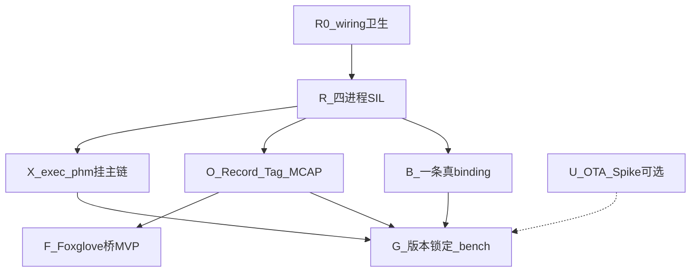

# P2 实施计划 — 真正可运行

> 路线图：[ROADMAP.md](ROADMAP.md) · P1 收口：[P1_PLAN.md](P1_PLAN.md) · Review：[P1_REVIEW_CHECKLIST.md](P1_REVIEW_CHECKLIST.md)

**状态（2026-07-15）：** P1 子轨骨架已齐（大量 **stub / offline**）。  
**P2 主题：** 从「可链接占位」升级到 **桌面多进程真正跑通**，并带上最小可观测证据。

---

## 0. 目标与原则

| 原则 | 含义 |
|------|------|
| **Runnable first** | 验收以「进程在跑、样本在流」为准，不以「库能编过」为准 |
| **一条主演示链** | 以 `afc_with_uss` **四节点 iceoryx SIL** 为 P2 主验收；其它 binding 选 **一条** 真后端加深 |
| **生成物进 App** | 四进程全部 `GF_USE_GENERATED=ON`，按 wiring 的 provides→Skeleton / requires→Proxy |
| **Stub 分级** | 主链上去 stub；OTA/DoIP/真 MCU **仍可 stub**，不挡主演示 |
| **工具边界不变** | gf-config 写 req/wiring；codegen 生成；GMT 只读度量/桥接 |

**一句话验收：**  
在桌面 Linux 上，一条命令拉起 RouDi + 四进程，EgoMotion → UssZones → FrontObjectList → Trajectory 链路可见；并能打 Tag、导出一段 MCAP。

---

## 1. P1 → P2：什么算「还是 stub」、P2 怎么处理

| P1 交付 | 现状 | P2 态度 |
|---------|------|---------|
| iceoryx 双进程 (uss_feed ↔ demo_pipeline) | ✅ 真跑 | **扩展为四进程**（主链） |
| Proxy / Skeleton generate | ✅ 头文件 | **四 App 全部接入** |
| exec / phm | 单测 smoke | **挂进多进程启动与监督** |
| CycloneDDS / vsomeip | offline stub 可链 | **二选一做真收发 demo**（另一条保持 stub） |
| ucm / diag DoIP | API stub | **不挡主链**；OTA 仅 Spike 选型 |
| GMT measure MCAP | JSONL→MCAP 雏形 | **Session Tag + 可复现导出**；Foxglove 桥 MVP |
| MCU desktop gateway | Unix socket 桌面 | 保持；**真板 / 真 CP 仍属 P3** |
| FIDL / ARXML import | 已可导入 | 清理 wiring 脏名；不做导出 |

---

## 2. 子轨与依赖顺序



| 顺序 | 子轨 | 内容 | 优先级 |
|------|------|------|--------|
| 0 | **R0** | 清理 `wiring` 截断服务名（`UssZon`/`UssZo` 等）；对齐 provides/requires/dataflows | P0 必做 |
| 1 | **R** | 四进程 App + `smoke_sil_4proc` / 扩展 `run_sil` | **主轨** |
| 2 | **X** | exec Offer/Running + phm Alive/Deadline 监督四进程（或关键两进程） | 主轨紧随 |
| 3 | **O** | Record Agent（环形缓冲）+ Session Tag + `GMT measure export` 可复现窗 | 主轨并行 |
| 4 | **B** | **CycloneDDS 真源码 pub/sub** *或* **vsomeip 真收发** 二选一 | 加深 |
| 5 | **F** | `GMT bridge foxglove` MVP（读 MCAP / 活流其一） | 体验 |
| 6 | **G** | schema/工具版本锁定；`bench_e2e_latency` CI golden | 收口 |
| 7 | **U** | OTA：RAUC vs 自研 ucm 后端 **Spike 文档+选型**（可不编码） | 可选 |

---

## 3. R — 四进程真正可运行（主轨）

### 3.1 目标拓扑（与 wiring 对齐）

| 进程 ID | 建议 App 目录 | Skeleton | Proxy |
|---------|---------------|----------|-------|
| `adapter.vehicle_can_gateway` | `apps/adapters/vehicle_can_gateway/`（新）或扩展现有 adapter | EgoMotion（+ 约定的 USS 相关若仍由 adapter 提供） | — |
| `sensing.uss` | 演进现有 `apps/simulators/uss_feed/` | UssZones | EgoMotion |
| `perception.front` | `apps/perception/front/`（新；可由 demo_pipeline 拆出） | FrontObjectList | EgoMotion, UssZones |
| `planning.driving` | `apps/planning/driving/`（新） | Trajectory | FrontObjectList, EgoMotion（+ 约定） |

> 现有 `uss_feed` + `demo_pipeline` **可保留为双进程回归**；P2 验收以四进程脚本为准。

### 3.2 交付物

| # | 交付物 | 说明 |
|---|--------|------|
| R-1 | wiring 卫生 + compose/lineage 绿 | 无截断假服务；generate 无垃圾 proxy/skeleton |
| R-2 | 四可执行文件 | 均 `#include gf_gen/{proxy,skeleton}/…`，`GF_USE_GENERATED=ON` |
| R-3 | CMake / `gf_build.cmake` / `GF_APPS` | compose 产出的 app 列表能编进四进程 |
| R-4 | `projects/oem_a/afc_with_uss/scripts/run_sil_4proc.sh` | RouDi + 四进程；stdout 可见链路样本（seq / nearest / object_count / traj） |
| R-5 | `smoke_sil_4proc.sh` | compile → run → 超时内断言「下游至少收到 N 帧」 |
| R-6 | 短文档 | `afc_with_uss` 集成说明：谁提供谁订阅、如何只开双进程回归 |

### 3.3 验收

- [ ] `bash …/smoke_sil_4proc.sh` 退出码 0
- [ ] 四进程同时存活 ≥ 30s（或脚本约定窗口）
- [ ] 至少一条 dataflow 端到端有计数（例如 planning 打印收到的 FrontObjectList seq）
- [ ] 不依赖 stub DDS/SOME/IP（主链仍用 **iceoryx**）

---

## 4. X — exec / phm 挂上主链

| # | 交付物 | 说明 |
|---|--------|------|
| X-1 | 启动编排 | 四进程（或 EM 代理）走 exec Offer→Running；非「裸 main 无限循环」无监督 |
| X-2 | Alive 监督 | 至少对 perception 或 planning 开 Alive；杀进程 / 停喂狗 → phm 可见 miss |
| X-3 | 故障注入脚本 | `scripts/fault_inject_ipc_timeout.sh` 或进程暂停 1 例（对应 ROADMAP 旧 P2-5 收敛） |
| X-4 | 文档 | OTA 时 `SetPaused` 与主链关系（沿用 P1 ucm README，补四进程场景） |

### 验收

- [ ] 正常启动四进程均 Running
- [ ] 注入 1 次 Alive miss 可观测（日志或 GMT 事件），恢复后继续跑

---

## 5. O / F — 可观测（为「真跑」服务，不做空壳）

| # | 交付物 | 说明 |
|---|--------|------|
| O-1 | Record Agent（桌面） | 环形缓冲订阅关键服务（或 JSONL sink）；与四进程同机 |
| O-2 | Session **Tag** | 运行中打 tag（CLI 或信号）；导出窗 = tag±Δt |
| O-3 | `GMT measure export` | 从真实 session（非仅 fixture）导出 MCAP，魔数 `\x89MCAP0` |
| O-4 | 文档化 10 分钟场景 | 「跑 10 min → 第 6 min tag → 导出 ±3 min」可复现步骤 |
| F-1 | Foxglove 桥 MVP | `GMT bridge foxglove`：读导出的 MCAP **或** 活流二选一；不追求完整布局 |

### 验收

- [ ] 按 O-4 步骤导出的 MCAP 可在 Foxglove / PlotJuggler 打开至少 1 个 topic
- [ ] CI 可用短 session fixture 回归 export（长跑不进默认 CI）

---

## 6. B — 一条真 binding（加深，非双栈量产）

**决策（开工第一天冻结）：**

| 选项 | 适用 | P2 交付 |
|------|------|---------|
| **B-DDS**（推荐若偏 ROS 生态） | 真 CycloneDDS 源码树（`middleware/third_party` 或 deps 脚本） | 单服务 pub/sub demo + profile；iceoryx 主链不变 |
| **B-SOMEIP**（推荐若偏车规 SOA） | 真 vsomeip（+ 必要 Boost） | 单服务 offer/find/event + 可选 `.fdepl` 数字 ID 进配置 |

**明确不做（P2）：** 两套都做到量产级；完整 CommonAPI 生成；把 fdepl 当成 `req.bindings`。

### 验收

- [ ] 选定栈的 smoke：**真后端**收发 ≥ 1 个 event（非 Init/Shutdown stub）
- [ ] 另一栈可保持 P1 stub，文档标明

---

## 7. G — 收口与证据

| # | 交付物 |
|---|--------|
| G-1 | `gf-codegen` / GMT / SOR schema **版本锁定**说明（谁升谁跟） |
| G-2 | `bench_e2e_latency`：四进程或双进程延迟采样 → CI golden（阈值可松） |
| G-3 | 证据包目录样例：`evidence_pack/`（HTML 或 JSON 索引 + MCAP 指针） |
| G-4 | ROADMAP / 本计划勾选；`P2_REVIEW_CHECKLIST.md`（收口时写） |

---

## 8. U — OTA Spike（可选，不挡主验收）

- 输出一页选型：RAUC vs 自研 ucm 后端 vs 「P3 再做」
- 不要求台架升级成功；P1 ucm 状态机 stub 可继续用

---

## 9. 明确不做（P2）

- 真 MCU / 真 AUTOSAR CP / 车载板 24h soak（→ P3）
- 真 DoIP 台架互通、量产 OTA A/B（→ P3）
- IoNAS / Classic↔ARXML 完整互转；gf-config 内嵌 FARACON
- MIPS / RISC-V OSAL 实板（→ P3）
- GMT 完整 GUI；板端配置 GUI
- iceoryx + DDS + SOME/IP **三栈同时**量产级 QoS
- ISO 26262 认证材料（工程证据 ≠ 认证）

---

## 10. 推荐节奏（约 3–4 周参考）

| 周 | 焦点 | 出口 |
|----|------|------|
| **W1** | R0 + R：wiring 清洁；四 App 骨架；`run_sil_4proc` 能起来 | 四进程有心跳日志 |
| **W2** | R 收尾（端到端计数）+ X 最小监督 + O-1/O-2 雏形 | `smoke_sil_4proc` 绿 |
| **W3** | B 真 binding 一条 + O-3/O-4 MCAP 窗 | 选定栈真收发；MCAP 可开 |
| **W4** | F Foxglove MVP + G bench/锁定 + 文档/Review 清单 | **P2 可演示收口** |

联调入口（目标态）：

```bash
source .venv/bin/activate
pip install -e "tools/codegen[dev]" -e "tools/gmt[dev]" -e tools/config
# 作者改连线
gf-config projects/oem_a/afc_with_uss/project.yaml
# 生成
python -m gf_codegen.compose --project projects/oem_a/afc_with_uss/project.yaml
gf-codegen generate projects/oem_a/afc_with_uss/gf.sor.json \
  --out projects/oem_a/afc_with_uss/generated
# 四进程 SIL（P2 主验收）
bash projects/oem_a/afc_with_uss/scripts/smoke_sil_4proc.sh
```

---

## 11. 与旧 ROADMAP「P2」条目对照

| 旧 ROADMAP | 本计划 |
|------------|--------|
| P2-1 Record + Tag | → **O** |
| P2-2 measure bench + qos | → **G-2**（主链有数据后） |
| P2-3 Foxglove / plot | → **F**（MVP，靠后） |
| P2-4 VCD/GTKWave | **降级**：有空再文档化；不挡四进程验收 |
| P2-5 故障注入 | → **X-3**（收敛 1–2 例） |
| P2-6 版本锁定 | → **G-1** |
| P2-7 OTA Spike | → **U**（可选） |
| （缺失）四进程真跑 | → **R / R0**（**新主轨**） |
| （缺失）真 DDS 或 SOME/IP | → **B** |

---

## 12. 开工前需你确认的一个决策

**B 轨选哪条真 binding？**

1. **CycloneDDS**（利于后续 Foxglove/ROS 叙事）  
2. **vsomeip**（利于车规 SOA / fdepl 叙事）  

确认后 W3 按该选项排期；另一条保持 P1 stub 即可。
