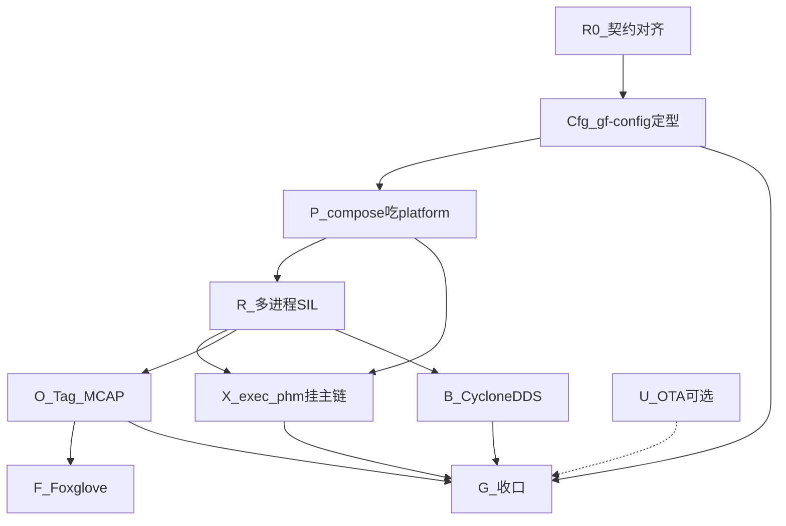

# P2 实施计划 — 真正可运行 + 平台配置骨架

> 路线图：[ROADMAP.md](ROADMAP.md) · P1：[P1_PLAN.md](P1_PLAN.md) · Review：[P1_REVIEW_CHECKLIST.md](P1_REVIEW_CHECKLIST.md)  
> **中间件 / gf-config 配什么（主规格）：** [MIDDLEWARE_CONFIG_PLAN.md](MIDDLEWARE_CONFIG_PLAN.md)  
> 集成基线：[afc_with_uss/INTEGRATOR_WALKTHROUGH.md](../../../projects/oem_a/afc_with_uss/INTEGRATOR_WALKTHROUGH.md)

**状态（2026-07-20）：** P1 骨架已齐；B 页信号图 / MCU / Lineage 可用；`platform/*.yaml` 空壳已落；**配置规格已冻结**（MIDDLEWARE_CONFIG_PLAN）。  
**P2 主题：** **先定型 gf-config（A/B/C）** → 再多进程真跑 + 可观测 + CycloneDDS。  
**排期原则：Cfg 轨优先** — 入口不定，后面 SIL/codegen 都难对齐。

---

## 0. 目标与原则

| 原则 | 含义 |
|------|------|
| **Config first** | **先做齐 gf-config A·SKU / B·信号 / C·平台** + compose 读 platform；再堆 SIL |
| **Runnable second** | 配置入口稳定后，验收仍以「进程在跑、样本在流」为准 |
| **一条主演示链** | `oem_a/afc_with_uss` 多进程 iceoryx SIL（无 FAPA） |
| **粗端口不变** | wiring 继续 fat port |
| **生成物进 App** | 主链 `GF_USE_GENERATED=ON` |
| **Stub 分级** | OTA / 真 DoIP / 真 MCU 仍可 stub |
| **工具边界** | gf-config **写** req/wiring/**platform**；codegen 生成；GMT **只读** |
| **无 DEM** | 诊断仅 `ara::diag` 小表 |

**一句话验收（P2 收口）：**  
用 gf-config 配完 SKU + 连线 + 平台清单并 Verify 通过；再一条脚本拉起主链 SIL（gateway→fcm/uss→planning），exec/phm 可读配置；Tag→MCAP；CycloneDDS 旁路真收发。

---

## 1. 已冻结决策（开工勿再摇摆）

| # | 决策 | 说明 |
|---|------|------|
| D1 | **主项目** | 扩展 `projects/oem_a/afc_with_uss`（不新开项目） |
| D2 | **B 轨 binding** | **CycloneDDS** 真源码 pub/sub；vsomeip **保持 P1 stub** |
| D3 | **EgoMotion 源** | 车端 CAN 经 gateway（DBC 可合并多 ECU 报文）；**uss.dbc 不进车身 info** |
| D3b | **无泊车** | `afc_with_uss` **无 `perception.fapa`**（FAPA=泊车）；带泊车另开 SKU |
| D4 | **MCU** | 画布特殊节点；yaml 保留 VehicleBus/Trajectory；真 CP → P3 |
| D5 | **平台 ③** | exec(+sm∈function_groups) / phm / diag / **log** / **ucm 空壳**；**无 DEM**；见 MIDDLEWARE_CONFIG_PLAN |
| D6 | **gf-config** | **P2 做齐 A·SKU / B·信号 / C·平台**（C 不进 P3）；YAML 已空壳；GMT **不写**配置 |

---

## 2. P1 → P2：现状与态度

| 交付 | 现状 | P2 态度 |
|------|------|---------|
| gf-config B + Verify/MCU | ✅ 可用 | **W1–W2 主攻**：A 瘦身 + **C·平台** + compose 读 platform |
| platform/*.yaml 空壳 | ✅ 已落 | compose 校验 + C 页编辑 |
| W0 粗端口 wiring（无 FAPA） | ✅ 基线 | Cfg 之后 R 轨按此跑 SIL |
| iceoryx 双进程 | ✅ 真跑 | 扩展为 **多进程主链** |
| Proxy/Skeleton generate | ✅ 头文件 | **主链 App 全部接入** |
| exec / phm | 单测 smoke | **platform 配置 + 挂主链监督** |
| diag DoIP | API stub | **platform/diag.yaml 最小表**；真台架 → P3 |
| CycloneDDS | offline stub | **真源码收发 demo（B）** |
| GMT MCAP | fixture 雏形 | **真实 session + Tag 窗**；Foxglove MVP |
| DEM | — | **不做** |

---

## 3. 子轨与依赖（**Cfg 在前**）



| 顺序 | 子轨 | 内容 | 优先级 |
|------|------|------|--------|
| 0 | **R0** | req/wiring/acceptance 与粗端口一致；lineage 绿 | 必做 · 很快 |
| 1 | **Cfg** | **gf-config 定型**：A 瘦身 · B 巩固 · **C·平台五子页** · 菜单已齐 | **最先主轨** |
| 2 | **P** | compose 读 `project.platform` → 校验 → `platform_manifest`；（可选）generate 常量表 | 紧随 Cfg |
| 3 | **R** | 多进程 App + smoke_sil_multiproc | 配置闭环后 |
| 4 | **X** | 读 platform → Running + Alive；故障注入 1 例 | 随 R |
| 5 | **O** | Record + Tag + MCAP | 并行加深 |
| 6 | **B** | CycloneDDS 真收发 | 加深 |
| 7 | **F** | Foxglove MVP | 体验 |
| 8 | **G / U** | 收口 / OTA Spike | 收口 |

---

## 4. R0 — 卫生与契约对齐（短）

| # | 交付物 |
|---|--------|
| R0-1 | acceptance / 文档与粗端口一致（无 FAPA / 无 FrontObjectList 主链叙事） |
| R0-2 | 现有 compose + lineage PASS（尚可不读 platform） |

### 验收

- [ ] compose afc_with_uss → lineage ok

---

## 5. Cfg — gf-config 定型（**最先主轨**）

> 目标形态：[MIDDLEWARE_CONFIG_PLAN.md §4](MIDDLEWARE_CONFIG_PLAN.md)。  
> **先做完本轨，再开 R 多进程大开发。**

| # | 交付物 |
|---|--------|
| Cfg-1 | **A · SKU 瘦身**：标识 / capabilities / runtime_modules / bindings / acceptance；apps 折叠或移出 |
| Cfg-2 | **B · 信号链接巩固**：现有画布+右侧连线/Lineage；无回归 |
| Cfg-3 | **C · 平台页（新建）**：子页编辑 exec / phm / diag / log / ucm；进程下拉只读自 wiring |
| Cfg-4 | Ctrl+S 写回对应 yaml；Verify 前 flush A+B+C |
| Cfg-5 | 菜单/快捷键与文档一致（无杂乱工具条） |

### 验收

- [ ] 打开 afc_with_uss：三页齐全，C 页能改 platform 并保存
- [ ] 改 Alive 超时 → 落盘 `phm.yaml`；改 FG → 落盘 `exec.yaml`
- [ ] external.* 默认不出现在 exec/phm 进程下拉
- [ ] B 页既有能力无回退

---

## 6. P — compose 吃 platform（紧随 Cfg）

> 字段见 MIDDLEWARE_CONFIG_PLAN §8。五文件已空壳：`exec/phm/diag/log/ucm`。

| # | 交付物 |
|---|--------|
| P-1 | compose 读 `project.yaml` → `platform:` 路径 |
| P-2 | 校验：exec/phm 的 process ∈ wiring（非 external）→ 失败非 0、信息可读 |
| P-3 | 写入 SOR `platform_manifest`（或旁路 JSON） |
| P-4 | （可选）generate 常量表供运行时加载 |
| P-5 | Verify（Ctrl+R）跑通含 platform 的检查 |

### 验收

- [ ] 故意写错 process → compose/Verify 失败
- [ ] 正确配置 → lineage/compose ok，SOR 含 platform 段
- [ ] 无 dem.yaml / 无 DEM 轨

---

## 7. R — 多进程真正可运行（配置闭环之后）

### 7.1 拓扑（W0）

```text
MCU/车身(可 sim) ──VehicleBus──► gateway ──fat outs──► fcm / uss ──► planning
                      ▲                                    │
                      └── Trajectory ◄── gateway ◄─────────┘
```

| 进程 | 方向 |
|------|------|
| `adapter.vehicle_can_gateway` | 新或扩展 adapter |
| `sensing.uss` | 演进 `uss_feed` |
| `perception.fcm` | 前视行车感知（本 SKU 有） |
| `planning.driving` | 新或拆 demo |

> **`perception.fapa`（泊车）不在本 SKU。** 带泊车的行泊一体见 `oem_b/adc_full` 等。  
> `external.vehicle_mcu` 不做 AP iceoryx 进程。双进程回归保留。

### 7.2 交付物

| # | 交付物 |
|---|--------|
| R-1 | 主链可执行文件 + `GF_USE_GENERATED=ON` |
| R-2 | CMake / `GF_APPS` / `gf_build.cmake` |
| R-3 | `scripts/run_sil_multiproc.sh` |
| R-4 | `scripts/smoke_sil_multiproc.sh`（下游 N 帧断言） |
| R-5 | 双进程回归说明 |

### 验收

- [ ] smoke 绿；约定窗口内存活
- [ ] 端到端至少一跳有计数
- [ ] 主链 **iceoryx**

---

## 8. X — exec / phm 挂主链

| # | 交付物 |
|---|--------|
| X-1 | Offer→Running（读 `platform/exec.yaml`） |
| X-2 | 1～2 进程 Alive（读 `platform/phm.yaml`） |
| X-3 | 故障注入 1 例 |
| X-4 | 与 OTA Pause 关系文档 |

### 验收

- [ ] 启动 Running；Alive miss 可观测并可恢复

---

## 9. O / F — 可观测

| # | 交付物 |
|---|--------|
| O-1～O-4 | Record、Tag、真实 session→MCAP、10min 演示步骤 |
| F-1 | Foxglove 桥 MVP |

### 验收

- [ ] MCAP 可打开 ≥ 1 topic；CI 短 fixture 回归 export

---

## 10. B — CycloneDDS 真收发（已选定）

| # | 交付物 |
|---|--------|
| B-1 | 依赖可复现获取 |
| B-2 | 真后端 pub/sub smoke |
| B-3 | 文档：主链仍 iceoryx；vsomeip stub |

### 验收

- [ ] DDS 真收发 ≥ 1 event；不阻塞主链 SIL

---

## 11. G / U — 收口与可选

G：版本锁定、bench golden、证据包、`P2_REVIEW_CHECKLIST.md`  
U：OTA Spike 一页（可选）

---

## 12. 明确不做（P2）

- **DEM**
- 真 MCU / 真 CP / 车载板 soak（→ P3）
- 真 DoIP 台架、量产 OTA（→ P3）
- GMT 可写配置 / GMT 完整 GUI
- IoNAS；fidl/fdepl 导出；三栈量产级；ISO 26262
- （已取消）「平台 GUI 放到 P3」— **C 页在 P2 Cfg 轨完成**

---

## 13. 节奏（约 4～5 周 · **Cfg 在前**）

| 周 | 焦点 | 出口 |
|----|------|------|
| **W1** | R0 + **Cfg-1/2/3**：A 瘦身 + C·平台页骨架（能读/写五 yaml） | 三页可用；保存落盘 |
| **W2** | **Cfg 收尾** + **P**：compose/Verify 吃 platform + 校验 | 错 process 能红；SOR 含 platform |
| **W3** | **R** 多进程骨架/端到端 + **X** 最小监督 | smoke 绿；Alive 读配置 |
| **W4** | **B** Cyclone + **O** Tag/MCAP | DDS smoke；MCAP 可开 |
| **W5** | **F** + **G** 收口（可压缩进 W4 末） | **可演示收口** |

```bash
gf-config projects/oem_a/afc_with_uss/project.yaml   # 先把 A/B/C 配稳
python -m gf_codegen.compose --project projects/oem_a/afc_with_uss/project.yaml
bash projects/oem_a/afc_with_uss/scripts/smoke_sil_multiproc.sh
```

---

## 14. 与旧草案对照

| 旧草案 | 本版 |
|--------|------|
| SIL 与配置并行 / GUI 后置 | **Cfg 最先**；C·平台 P2 必做 |
| 四进程 + FrontObjectList | gateway/fcm/uss/planning（无 FAPA） |
| B 待定 | CycloneDDS |
| 无 platform | 五 yaml + compose + C 页 |

---

## 15. 开工检查清单（按你的优先级）

- [x] D1–D6 / MIDDLEWARE_CONFIG_PLAN 拍板
- [x] `platform/*.yaml` 空壳 + `project.yaml` 索引
- [ ] **W1：Cfg — A 瘦身 + C·平台页（读/写五文件）**
- [ ] W2：compose/Verify 吃 platform
- [ ] 其后：R App 目录落点 + smoke
