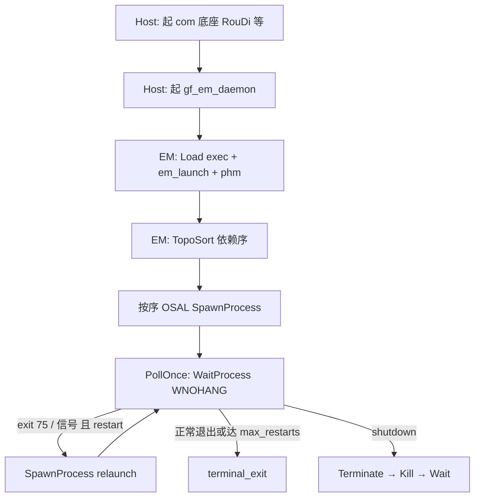

# exec

ARA-inspired **Execution** — Client（进程侧）+ 进程内 **EM 账本** + OS **`gf_em_daemon`**（经 OSAL Spawn/Wait）。

| API / 二进制 | 说明 |
|--------------|------|
| `ExecutionClient` | Offer / ReportExecutionState |
| `ExecutionManager` | 注册、状态镜像、`RequestRestart` 计数 |
| `EmDaemon` / `gf_em_daemon` | 读 `exec.yaml` + `em_launch.yaml` + `phm.yaml`；`gf::osal::SpawnProcess`；exit 75 / 信号 → relaunch |

**重启策略**

| 环境 | `on_failure: restart` 行为 |
|------|---------------------------|
| `GF_EM_MANAGED=1`（daemon 拉起） | 进程 exit **75** → OS relaunch |
| 未托管 / `GF_EM_SOFT_RESTART=1` | 进程内 soft Offer→Running |

## 板端启动流程



要点：

1. **EM 先于 Apps** — 业务进程由 daemon 统一拉起，不各自抢启动序。
2. **进程原语只经 OSAL** — `EmDaemon` 不直接 `fork`/`exec`/`waitpid`/`kill`。
3. **配置三件套** — `platform/exec.yaml`（依赖）、`platform/em_launch.yaml`（二进制）、`phm.yaml`（`on_failure: restart`）。

```bash
ctest -R 'gf_exec_|gf_em_daemon' --output-on-failure
# SIL:
bash scripts/verify/oem_a_afc_with_uss/smoke_sil_em_daemon.sh
```

Parent: [middleware/README.md](../README.md)

FuSa cases: [exec_cases.md](../../fusa/cases/exec_cases.md).
