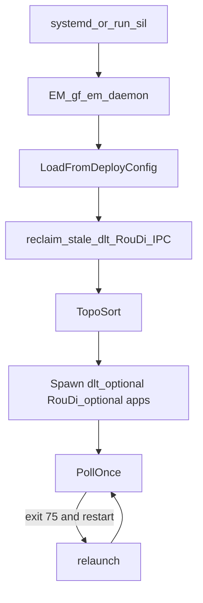

# exec

ARA-inspired **Execution** — Client（进程侧）+ 进程内 **EM 账本** + OS **`gf_em_daemon`**（经 OSAL Spawn/Wait）。

| API / 二进制 | 说明 |
|--------------|------|
| `ExecutionClient` | Offer / ReportExecutionState |
| `ExecutionManager` | 注册、状态镜像、`RequestRestart` 计数 |
| `EmDaemon` / `gf_em_daemon` | 产品：`LoadFromDeployConfig`（`deploy_config.hpp`）；smoke：YAML；`SpawnProcess`；exit 75 / 信号 → relaunch |

**重启策略**

| 环境 | `on_failure: restart` 行为 |
|------|---------------------------|
| `GF_EM_MANAGED=1`（daemon 拉起） | 进程 exit **75** → OS relaunch |
| 未托管 / `GF_EM_SOFT_RESTART=1` | 进程内 soft Offer→Running |

## 板端启动流程



要点：

1. **入口 = EM** — OS/`run_sil`/后期单一 systemd unit **只起 EM**；daemons（dlt?/RouDi?/…）与 SOA apps 按 gf-config 由 EM Spawn。
2. **进程原语只经 OSAL** — `EmDaemon` 不直接 `fork`/`exec`/`waitpid`/`kill`。
3. **配置** — 作者：`platform/*.yaml`；产品冻结：`generated/include/gf_gen/deploy_config.hpp`（compose → 编进 `gf_em_daemon`）。YAML dump 仅人读；smoke 可用 `--launch` / `GF_EM_USE_YAML=1`。
4. **CI**：`ctest -R gf_em_daemon_smoke`（最严模块门禁）；功能验收走 `run_sil`，不用 smoke 冒充。

```bash
ctest -R 'gf_exec_|gf_em_daemon' --output-on-failure
# SIL:
bash projects/oem_a/afc_with_uss/scripts/verify/smoke_sil_em_daemon.sh
```

Parent: [middleware/README.md](../README.md)

FuSa cases: [exec_cases.md](../../fusa/cases/exec_cases.md).
